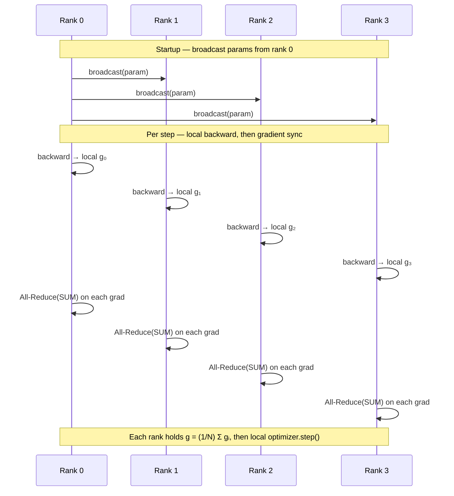

# Naive DDP: Hand-Written Gradient All-Reduce

> Each rank trains on a different data shard, then averages local gradients via All-Reduce so the update matches one large global batch.

## TL;DR

- Data is sharded across ranks; each rank runs forward + backward on its slice only.
- Parameters are replicated on every rank; gradients must be averaged before the optimizer step.
- Averaging = one **All-Reduce(SUM)** per parameter gradient, then divide by `world_size`.
- Initial weights are **broadcast** from rank 0 so all ranks start identical.

## The problem

Training on one GPU limits batch size and throughput. Data parallelism replicates the model on multiple ranks and splits the batch, so each rank computes gradients on a different slice. Because every rank holds the same parameters, those local gradients must be combined into one global average each step — otherwise ranks would diverge. Naive DDP makes that contract explicit: you hand-write the gradient sync instead of hiding it inside `DistributedDataParallel`.

## Algorithm

1. **Initialize**: Rank 0 holds the canonical parameters; **broadcast** every parameter tensor to all ranks (`broadcast_initial_params`, already provided).
2. **Shard data**: Build one global batch of size 64, then give each rank a disjoint slice (rank `r` gets indices `[r * per, (r+1) * per)`).
3. **Local forward + backward**: Each rank runs `TinyMLP` on its shard and produces **local** gradients $g_i$.
4. **Synchronize gradients**: For each parameter, compute the global average
   $$g = \frac{1}{N}\sum_{i=0}^{N-1} g_i$$
   via **All-Reduce(SUM)** followed by division by `world_size` ($N$).
5. **Optimizer step**: Apply SGD with the averaged gradients; because params started identical and grads were averaged, all ranks stay in sync.

This is mathematically equivalent to training on one batch of size `GLOBAL_BATCH`.

## Communication pattern



## What you'll see

On launch, `launch_teaching_cluster` prints a banner with `world_size=4` and `backend=gloo`, then spawns four color-coded rank logs. Each rank reports its local shard shape, e.g. `(16, 16)` for a global batch of 64 split four ways. Before your implementation, the run stops at:

```
NotImplementedError: TODO: implement cross-rank gradient All-Reduce averaging in synchronize_gradients
```

After a correct `synchronize_gradients`, all ranks print per-step local loss (which will differ per rank because each sees different data) and finish with rank 0 printing: *"Naive DDP done: if all ranks' final params match, gradient sync is correct."*

## Your battle zone

Implement **`synchronize_gradients(model, world_size)`** in `1_data_parallel/1_ddp_demo.py`. For each `p` in `model.parameters()` where `p.grad` is not `None`:

1. Move `p.grad` to **`COMM_DEVICE`** (where collectives run — a no-op on CPU/NCCL).
2. Call `dist.all_reduce(grad_cpu, op=dist.ReduceOp.SUM)`.
3. Divide by `world_size` to obtain the average.
4. Write the result back into `p.grad` on `p`'s compute device.

`broadcast_initial_params` is already implemented and shows the same move-to-CPU, communicate, copy-back pattern.

## Run it

```bash
python 1_data_parallel/1_ddp_demo.py
```

## Papers & further reading

- Li et al., 2020, "PyTorch Distributed: Experiences on Accelerating Data Parallel Training" (VLDB).
- Goyal et al., 2017, "Accurate, Large Minibatch SGD: Training ImageNet in 1 Hour".
- Sergeev & Del Balso, 2018, "Horovod: fast and easy distributed deep learning in TensorFlow" (ring all-reduce).
