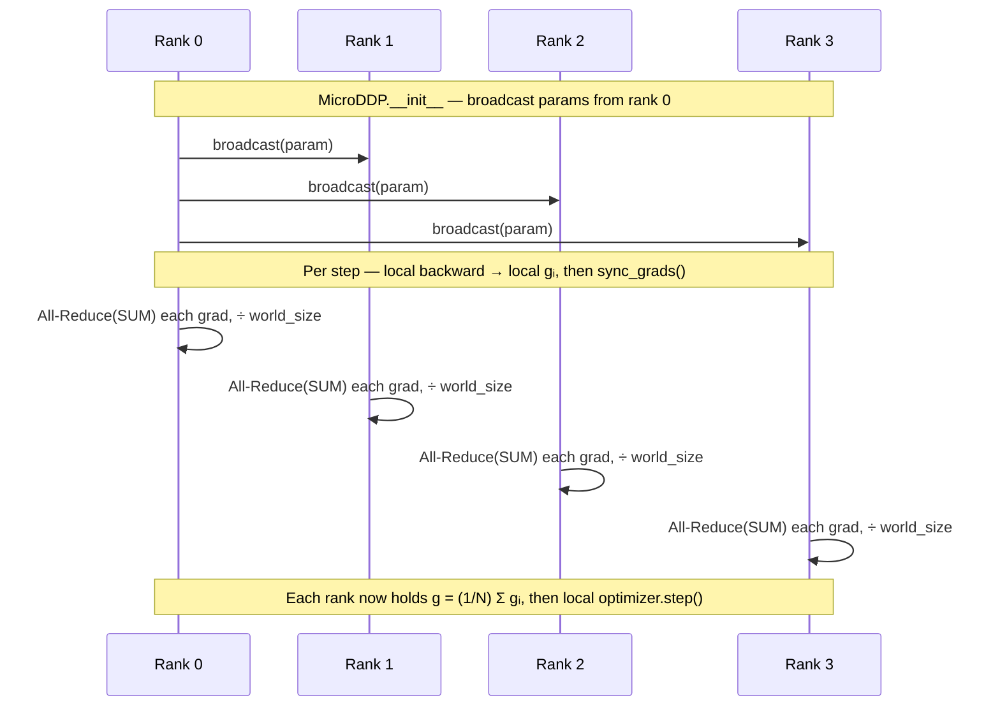

# Naive DDP: A From-Scratch DDP `Module` (Level 1)

> Each rank trains on a different data shard, then averages local gradients via one All-Reduce so the update matches one large global batch. Packaged as `MicroDDP(nn.Module)`.

## TL;DR

- Data is sharded across ranks; each rank runs forward + backward on its slice only.
- Parameters are replicated on every rank; gradients must be averaged before the optimizer step.
- Averaging = one **All-Reduce(SUM)** per parameter gradient, then divide by `world_size`.
- Initial weights are **broadcast** from rank 0 (inside `MicroDDP.__init__`) so all ranks start identical.

## The problem

Training on one GPU limits batch size and throughput. Data parallelism replicates the model on multiple ranks and splits the batch, so each rank computes gradients on a different slice. Because every rank holds the same parameters, those local gradients must be combined into one global average each step — otherwise ranks diverge. `MicroDDP` is our hand-written stand-in for `torch.nn.parallel.DistributedDataParallel`: `ddp = MicroDDP(model, world_size)`, call `ddp(x)` like a normal module, and after `backward()` call `sync_grads()` to average.

This level is the baseline. Two follow-ups keep the same math but make the communication faster:

- [`2_ddp_overlap.py`](2_ddp_overlap.md) — fire each grad's All-Reduce from a backward hook, overlapping comm with compute.
- [`3_ddp_bucketing.py`](3_ddp_bucketing.md) — reduce whole buckets of grads asynchronously at once (the real DDP combo).

## Algorithm

1. **Initialize**: `MicroDDP.__init__` **broadcasts** every parameter from rank 0 so all ranks start identical (provided).
2. **Shard data**: build one global batch of size 64, give each rank a disjoint slice.
3. **Local forward + backward**: each rank runs `TinyMLP` on its shard and produces **local** gradients $g_i$.
4. **Synchronize** (`sync_grads`, your battle zone): for each parameter, compute the global average
   $$g = \frac{1}{N}\sum_{i=0}^{N-1} g_i$$
   via **All-Reduce(SUM)** then divide by `world_size` ($N$).
5. **Optimizer step**: SGD with the averaged gradients keeps all ranks in sync.

Mathematically equivalent to training on one batch of size `GLOBAL_BATCH`.

## Communication pattern



## What you'll see

The cluster banner (`world_size=4`, `backend=gloo`) and four color-coded rank logs reporting their local shard shape, e.g. `(16, 16)`. Before your implementation the run stops at:

```
NotImplementedError: TODO: average each parameter's gradient across ranks in sync_grads
```

Once correct, rank 0 prints `sync_grads | max err vs full-batch grad = 2.4e-07` (the averaged grad matches the gradient on the full global batch), then per-step local losses, and a done line.

## Your battle zone

Implement **`MicroDDP.sync_grads`** in `1_data_parallel/1_ddp_demo.py`. Each rank holds gradients from its own shard only; make every rank end up with the average across all ranks, parameter by parameter. Think about which single collective sums a tensor across ranks, and what turns that sum into a mean. (Skip params whose `grad` is `None`.)

## Run it

```bash
python 1_data_parallel/1_ddp_demo.py
```

## Papers & further reading

- Li et al., 2020, "PyTorch Distributed: Experiences on Accelerating Data Parallel Training" (VLDB).
- Goyal et al., 2017, "Accurate, Large Minibatch SGD: Training ImageNet in 1 Hour".
- Sergeev & Del Balso, 2018, "Horovod: fast and easy distributed deep learning in TensorFlow" (ring all-reduce).
