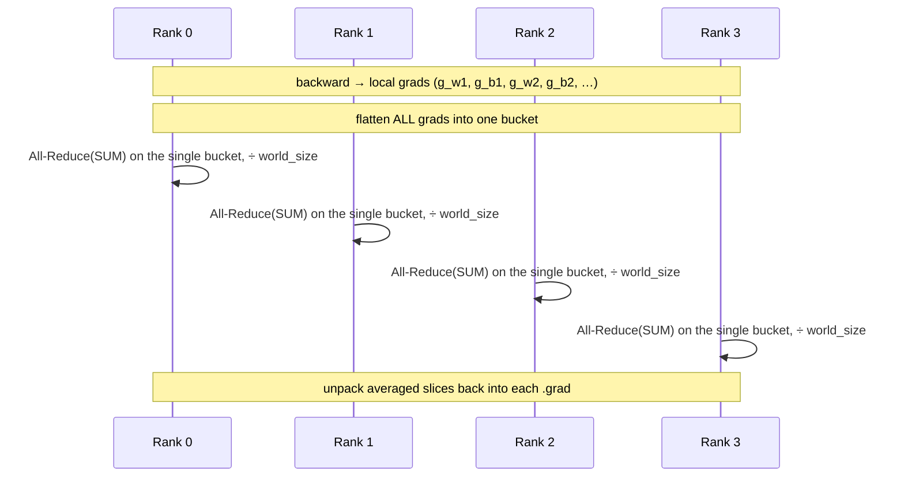

# DDP with Gradient Bucketing (Level 2)

> Same gradient average as naive DDP, but coalesced into **one** All-Reduce instead of one per parameter — amortizing the fixed per-collective cost.

## TL;DR

- Naive DDP (Level 1) issues one All-Reduce **per parameter tensor**. Each collective has a fixed launch/latency cost, so $N$ params cost that $N$ times per step.
- Bucketing packs all grads into **one contiguous buffer**, fires a **single** All-Reduce(SUM)+divide, then scatters the averaged result back into each `.grad`.
- Identical math to Level 1; far fewer collectives. Real DDP groups grads into ~25 MB buckets for exactly this reason.

## The problem

Collective calls aren't free: every `all_reduce` pays kernel-launch + handshake latency regardless of payload size. A model with many small parameter tensors (weights, biases, norms…) spends most of its sync time on per-call overhead, not on moving bytes. Fusing the gradients into one big message pays that fixed cost once.

## Algorithm

`MicroDDP` is unchanged from Level 1 (broadcast on init, `forward` delegates). Only `sync_grads` changes:

1. Collect the non-`None` grads.
2. **Flatten** them into one 1-D buffer (concatenate each `grad.reshape(-1)`).
3. **One** `All-Reduce(SUM)` on the buffer, then divide by `world_size`.
4. **Scatter back**: walk an offset through the buffer and copy each slice, reshaped to the original grad shape, back in place.

The only subtlety is bookkeeping — grads have different shapes, so you must remember where each lives in the flat buffer to restore it correctly.

## Communication pattern



## What you'll see

Before your implementation the run stops at `NotImplementedError: TODO: implement single-bucket gradient All-Reduce in sync_grads`. Once correct, rank 0 prints `bucketed sync | max err vs full-batch grad = 1.8e-07` — the same answer as naive DDP, with one fused collective per step.

## Your battle zone

Implement **`MicroDDP.sync_grads`** in `1_data_parallel/2_ddp_bucketing.py`: build one flat bucket from all grads, average it with a single All-Reduce, and write each averaged slice back into the grad it came from (`reshape`/`cat`/`copy_` are all you need — no torch private helpers).

## Run it

```bash
python 1_data_parallel/2_ddp_bucketing.py
```

## Papers & further reading

- Li et al., 2020, "PyTorch Distributed: Experiences on Accelerating Data Parallel Training" (VLDB) — the bucketing design this mirrors.
- NCCL docs on collective launch overhead and message coalescing.
