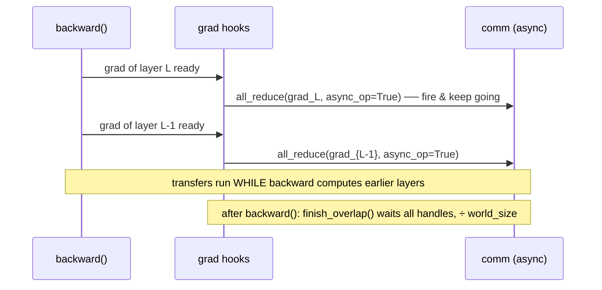

# DDP with Comm/Compute Overlap (Level 2)

> Don't wait for backward to finish before averaging — fire each gradient's All-Reduce the instant it's ready, from an autograd hook, so communication hides behind the rest of backward.

## TL;DR

- A parameter's gradient is ready as soon as its layer's backward completes — well before the earliest layers finish.
- Register a **post-accumulate-grad hook** per parameter; it fires the moment `.grad` is populated.
- In the hook, launch a **non-blocking** All-Reduce(SUM). After `backward()`, **wait** on all of them and finish the averaging.
- This is the heart of how real DDP overlaps communication with computation for near-linear scaling.

## The problem

Level 1 runs the gradient sync *after* `backward()` fully returns — communication and computation happen back-to-back, so total step time ≈ compute + comm. But gradients become available incrementally during backward (last layer first). If we start reducing each gradient the moment it's ready, its transfer overlaps with the backward still computing earlier layers, and comm time largely disappears behind compute.

> On a single CPU box there's no wall-clock win to observe — the lesson is the **mechanism**: hooks + async collectives + a wait barrier. The exact same code is what pays off on a real GPU cluster.

## Algorithm

`MicroDDP.__init__` broadcasts the weights and registers `register_post_accumulate_grad_hook` on every parameter (provided). A guard flag `overlap_enabled` keeps the hook dormant while we compute a clean reference.

1. `ddp.overlap_enabled = True`
2. `loss.backward()` — as each `.grad` lands, the **hook** (your battle zone A) fires a non-blocking All-Reduce(SUM) and records the work handle.
3. `ddp.finish_overlap()` (your battle zone B) — wait on every in-flight handle, then divide each grad by `world_size`.

## Communication pattern



## What you'll see

Before your implementation the run stops at `NotImplementedError: TODO(a): launch an async All-Reduce in _overlap_hook` (and then `TODO(b)`). Once both are correct, rank 0 prints `overlapped sync | max err vs full-batch grad = 2.4e-07` — the same average as naive DDP, produced by comm fired from inside backward. Level 3 then reduces whole **buckets** this same way.

## Your battle zones

In `1_data_parallel/2_ddp_overlap.py`:

1. **(a) `_overlap_hook(param)`** — the `if not self.overlap_enabled: return` guard is provided. Start a non-blocking All-Reduce(SUM) on `param.grad` and stash what `finish_overlap` needs in `self._handles`. (`dist.all_reduce` has an `async_op` flag and returns a work handle.)
2. **(b) `finish_overlap()`** — drain `self._handles`: wait on each in-flight reduce, finish averaging that grad, reset the list.

## Run it

```bash
python 1_data_parallel/2_ddp_overlap.py
```

## Papers & further reading

- Li et al., 2020, "PyTorch Distributed: Experiences on Accelerating Data Parallel Training" (VLDB) — gradient bucketing + overlap with backward.
- PyTorch docs: `Tensor.register_post_accumulate_grad_hook`, `torch.distributed` async collectives (`async_op=True`, `Work.wait()`).
