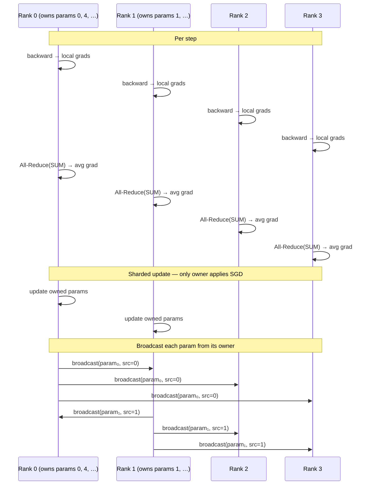

# ZeRO-1: Optimizer State Sharding

> After the same gradient All-Reduce as DDP, each rank updates only its owned parameter slice and broadcasts the result so everyone holds the full, latest weights.

## TL;DR

- Naive DDP replicates **optimizer state** on every rank (e.g. Adam $m$, $v$ ≈ 2× params) — wasted memory at scale.
- ZeRO-1 **shards optimizer state**: each rank owns and updates only a slice of the parameters.
- Per step: All-Reduce gradients → local update on owned slice → **broadcast** (All-Gather equivalent) updated params to all ranks.
- Optimizer-state memory saved scales as $(1 - 1/N)$ for world size $N$.

## The problem

In naive DDP every rank stores a full copy of the model **and** a full copy of the optimizer state. For Adam, momentum and variance buffers alone can be 2× the parameter footprint — multiplied by every GPU. ZeRO-1 (Zero Redundancy Optimizer, stage 1) asks: why duplicate optimizer state when each rank only needs to *apply* the update to a subset of parameters? Shard ownership across ranks, keep only local optimizer state, and reconstruct the full parameter vector after each step.

## Algorithm

1. **Assign ownership**: Partition parameter tensors across ranks (round-robin via `assign_param_owner`, already provided). Rank $r$ owns parameters where `owner[i] == r`.
2. **Shard data**: Same as DDP — each rank gets a disjoint slice of the global batch.
3. **Local forward + backward**: Each rank computes local gradients on its data shard.
4. **All-Reduce gradients**: Average gradients globally (identical to DDP):
   $$g = \frac{1}{N}\sum_{i=0}^{N-1} g_i$$
   using **All-Reduce(SUM)** then `/ world_size`.
5. **Sharded optimizer step**: If `owner[i] == rank`, apply a local SGD update to parameter $i$: $p \leftarrow p - \text{lr} \cdot g$ (real ZeRO-1 stores Adam $m/v$ here; this demo uses SGD for simplicity).
6. **Broadcast updated params**: For each parameter $i$, **`dist.broadcast(param_cpu, src=owner[i])`** so every rank receives the owner's latest value — equivalent to an All-Gather over parameter slices.

Memory for optimizer state drops by a factor of $(1 - 1/N)$ because each rank holds state for roughly $1/N$ of the parameters.

## Communication pattern



## What you'll see

The cluster launches with four ranks (`world_size=4`). Each rank prints which parameter indices it owns, e.g. `params I own = [0, 4] (of 6 parameter tensors)` for a `TinyMLP` with six weight/bias tensors. Per-step local loss is logged in color-coded interleaved output.

Before implementation, the run fails at the first TODO:

```
NotImplementedError: TODO: reduce_average_gradients -- hand-write gradient All-Reduce averaging
```

After fixing that, it stops at the second TODO in `step_and_all_gather`. When both are correct, rank 0 prints: *"ZeRO-1 done: optimizer state is sharded, memory footprint drops with world_size."*

## Your battle zone

Two functions in `1_data_parallel/2_zero1_demo.py`:

**1. `reduce_average_gradients(model, world_size)`** — warm-up, same as DDP. For each `p.grad`: move to **`COMM_DEVICE`**, `dist.all_reduce(..., op=dist.ReduceOp.SUM)`, divide by `world_size`, write back to `p.grad` on `p.device`.

**2. `step_and_all_gather(model, owner, rank, world_size, lr)`** — the ZeRO-1 core. Iterate with `enumerate(model.parameters())`:
- **A.** If `owner[i] == rank`: apply SGD locally, `p.data -= lr * p.grad`.
- **B.** For every parameter (regardless of ownership): copy `p.data` to a CPU tensor on **`COMM_DEVICE`**, then `dist.broadcast(param_cpu, src=owner[i])`, then copy the result back to `p.data` on the compute device.

Using per-parameter broadcast from the owner is a simplification of All-Gather; concatenating slices via `dist.all_gather` is also valid.

## Run it

```bash
python 1_data_parallel/2_zero1_demo.py
```

## Papers & further reading

- Rajbhandari et al., 2020, "ZeRO: Memory Optimizations Toward Training Trillion Parameter Models" (SC20).
- Zhao et al., 2023, "PyTorch FSDP: Experiences on Scaling Fully Sharded Data Parallel".
