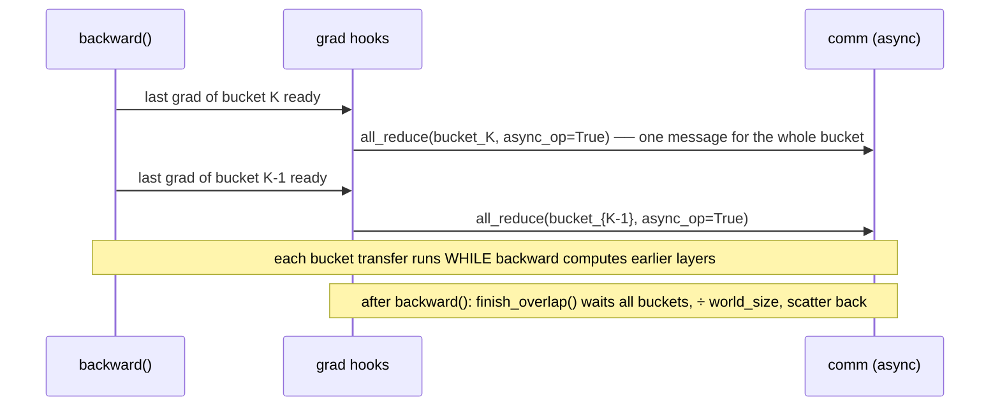

# DDP with Bucketed Overlap (Level 3)

> Combine Level 2's overlap with coalescing: group params into **buckets** and fire one async All-Reduce per *bucket* the moment its last grad is ready — fewer, larger collectives, each still hidden behind backward. This is how real DDP actually works.

## TL;DR

- Level 2 overlapped comm by firing **one async All-Reduce per parameter**. Correct, but $N$ tensors still mean $N$ collective launches per step.
- Bucketing groups params into a handful of buckets. When **every** grad in a bucket has landed, reduce the whole bucket with a **single** non-blocking All-Reduce(SUM).
- After `backward()`, **wait** on each in-flight bucket, divide by `world_size`, and scatter the averaged slices back into each `.grad`.
- Same math as naive DDP; the latency win of overlap *and* the per-call savings of bucketing, together — exactly torch DDP's ~25 MB bucket design.

## The problem

Per-parameter async reduces (Level 2) hide latency but flood the network with one tiny collective per tensor — and every collective pays a fixed launch/handshake cost regardless of size. Real models have hundreds of parameter tensors. Bucketing fuses each group of grads into one message, so you launch a few well-sized reduces instead of hundreds of tiny ones — while *still* overlapping each with the backward computing earlier layers.

> On a single CPU box there's no wall-clock win to observe — the lesson is the **mechanism**: buckets + async collectives + a wait barrier. The same code is what scales on a real GPU cluster.

## Algorithm

`MicroDDP.__init__` broadcasts the weights, then (provided plumbing) assembles params into buckets **in reverse order** — grads become ready last-layer-first, so the bucket that fills first is the first one reducible. A per-bucket counter tracks how many grads are still missing; a post-accumulate-grad hook counts it down.

1. `ddp.overlap_enabled = True`
2. `loss.backward()` — each `.grad` decrements its bucket's counter (provided). When a bucket hits zero, the hook calls **`_reduce_bucket`** (your battle zone A): flatten the bucket's grads into one buffer and fire a non-blocking All-Reduce(SUM), recording the handle.
3. `ddp.finish_overlap()` (your battle zone B) — wait on every in-flight bucket, divide by `world_size`, and unpack each averaged slice back into its param's `.grad`.

## Communication pattern



## What you'll see

Before your implementation the run stops at `NotImplementedError: TODO(a): reduce a full bucket asynchronously in _reduce_bucket` (and then `TODO(b)`). Once both are correct, rank 0 prints `bucketed-overlap sync | max err vs full-batch grad = 2.4e-07` — the same average as naive DDP, produced by one async reduce per bucket.

## Your battle zones

In `1_data_parallel/3_ddp_bucketing.py`:

1. **(a) `_reduce_bucket(params)`** — fires once per bucket when all its grads are ready. Pack the bucket's grads into one contiguous buffer, launch a single non-blocking All-Reduce(SUM), and stash the work handle + buffer + params for later. Don't average yet.
2. **(b) `finish_overlap()`** — for each recorded bucket: wait on its reduce, divide the summed buffer by `world_size`, and unpack each averaged slice back into its param's `.grad` (mind the per-param offsets). Reset the list.

## Run it

```bash
python 1_data_parallel/3_ddp_bucketing.py
```

## Papers & further reading

- Li et al., 2020, "PyTorch Distributed: Experiences on Accelerating Data Parallel Training" (VLDB) — gradient bucketing + overlap with backward, the design this mirrors.
- PyTorch docs: `Tensor.register_post_accumulate_grad_hook`, `torch.distributed` async collectives (`async_op=True`, `Work.wait()`).
- NCCL docs on collective launch overhead and message coalescing.
