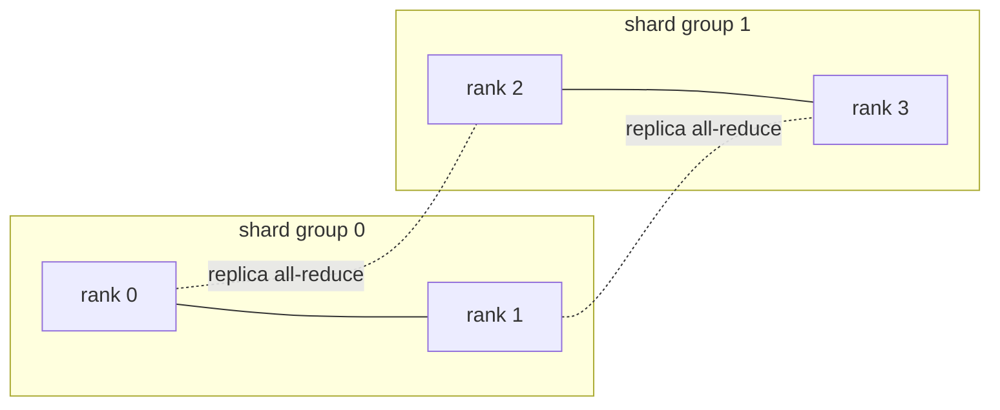

# Hybrid Sharded Data Parallel (`3_hsdp.py`)

> FSDP on a 2D mesh: shard parameters **within** a node (fast links) and replicate **across** nodes (slow links), so the expensive parameter All-Gather stays node-local.

Run:

```bash
python 1_data_parallel/3_hsdp.py
```

## The idea

Pure FSDP (`2_fsdp.py zero3`) shards parameters across **all** ranks, so its parameter All-Gather spans every node and its slow inter-node links on every step. HSDP arranges ranks on a 2D mesh:

```
shard dimension   ×   replica dimension
(FSDP inside it)      (plain DDP across it)
```

- **Shard group** (one node, fast NVLink): parameters/gradients are FSDP-sharded.
- **Replica group** (across nodes, slow): the model is replicated, like DDP.

So the costly parameter All-Gather stays intra-node, and only a gradient All-Reduce crosses nodes. This is `HYBRID_SHARD` in PyTorch FSDP.

## The gradient sync (your battle zone)

`hsdp_sync_grad` is a two-step reduction on the mesh (the 2D process groups are built for you in `build_mesh_groups`):

1. **Reduce-Scatter within the shard group** (size `SHARD`) — each rank ends up owning one gradient shard, summed over the node.
2. **All-Reduce across the replica group** (size `REPLICA`) — sum that shard over the replicas.
3. **Divide by world_size** — the global average for this rank's shard.



`dist.new_group` is collective, so **every** rank must create **every** subgroup (even ones it won't join) — that's why `build_mesh_groups` loops over all of them.

## What you'll see

Each rank prints its mesh coordinate (`replica=…, shard=…`) and a per-step `mesh-sync err vs global avg`. Before implementation the run stops at the `NotImplementedError` in `hsdp_sync_grad`; once correct, the error is ~`1e-7` — the two-step mesh reduction matches a plain global All-Reduce, but the heavy parameter traffic never left the node.

## Papers & further reading

- Zhao et al., 2023, "PyTorch FSDP: Experiences on Scaling Fully Sharded Data Parallel" — `HYBRID_SHARD`.
- PyTorch docs: `torch.distributed.new_group`, `reduce_scatter`, `all_reduce`.
