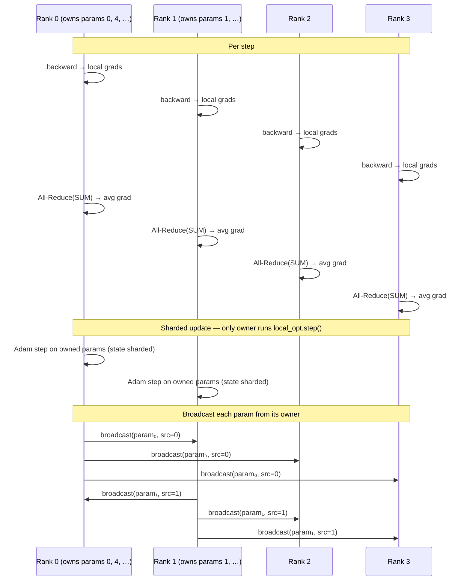

# ZeRO-1: Optimizer State Sharding

> A from-scratch `MicroZeroOptimizer` (our stand-in for `torch.distributed.optim.ZeroRedundancyOptimizer`): wrap a real base optimizer over only the params this rank owns, so the optimizer state is genuinely sharded. Each step averages grads, runs the local optimizer, and All-Gathers the updated params.

## TL;DR

- Naive DDP replicates **optimizer state** on every rank (e.g. Adam $m$, $v$ ≈ 2× params) — wasted memory at scale.
- ZeRO-1 **shards optimizer state**: each rank builds its base optimizer (`Adam`, `SGD`, …) over only its owned parameter slice, so the state buffers exist on exactly one rank.
- Per step: All-Reduce gradients → `local_opt.step()` updates only owned params → **All-Gather/broadcast** the updated params to all ranks.
- Optimizer-state memory saved scales as $(1 - 1/N)$ for world size $N$.

## The problem

In naive DDP every rank stores a full copy of the model **and** a full copy of the optimizer state. For Adam, momentum and variance buffers alone can be 2× the parameter footprint — multiplied by every GPU. ZeRO-1 (Zero Redundancy Optimizer, stage 1) asks: why duplicate optimizer state when each rank only needs to *apply* the update to a subset of parameters? Shard ownership across ranks, keep only local optimizer state, and reconstruct the full parameter vector after each step.

`MicroZeroOptimizer` makes the sharding **concrete**: in `__init__` it computes `owner[i] = i % world_size`, then builds the base optimizer (`torch.optim.Adam` by default) over *only* the owned params. Because PyTorch optimizers lazily allocate their state per parameter they're given, the Adam $m/v$ buffers simply never exist on this rank for params it doesn't own — that is the memory win, not a hand-waved `p -= lr*g`.

## Algorithm

1. **Assign ownership** (in `__init__`): round-robin `owner[i] = i % world_size`; this rank's base optimizer is constructed over `[p for i,p in ... if owner[i]==rank]`.
2. **Shard data**: Same as DDP — each rank gets a disjoint slice of the global batch.
3. **Local forward + backward**: Each rank computes local gradients on its data shard.
4. **All-Reduce gradients** (`_average_grads`, battle zone 1): average gradients globally (identical to DDP):
   $$g = \frac{1}{N}\sum_{i=0}^{N-1} g_i$$
   using **All-Reduce(SUM)** then `/ world_size`.
5. **Sharded optimizer step** (provided): `self.local_opt.step()` updates only the owned params, using only their (sharded) optimizer state.
6. **All-Gather params** (`_sync_params`, battle zone 2): each parameter's new value lives on `owner[i]`, so propagate it to everyone — a per-param `dist.broadcast(p.data, src=owner[i])` is the simplest All-Gather.

Memory for optimizer state drops by a factor of $(1 - 1/N)$ because each rank holds state for roughly $1/N$ of the parameters.

## Communication pattern



## What you'll see

The cluster launches with four ranks (`world_size=4`). Each rank prints which parameter indices it owns, e.g. `params I own = [0, 4] (of 6 tensors) -> Adam state only for these`. Per-step local loss is logged in color-coded interleaved output.

Before implementation, the run fails at the first TODO:

```
NotImplementedError: TODO(1): average each grad across ranks in _average_grads
```

After fixing that, it stops at the second TODO in `_sync_params`. When both are correct, rank 0 prints a cross-rank parameter drift of `0.00e+00` — proof that after the sharded step + All-Gather every rank holds bit-identical weights.

## Your battle zone

Two methods of `MicroZeroOptimizer` in `1_data_parallel/4_zero1_demo.py` (the `__init__` ownership split and `local_opt.step()` are provided):

**1. `_average_grads()`** — warm-up, same as DDP. For each `p.grad`: `dist.all_reduce(..., op=dist.ReduceOp.SUM)`, then divide by `world_size`.

**2. `_sync_params()`** — the ZeRO-1 core. Each parameter's freshly updated value lives on `owner[i]`; propagate it to all ranks, e.g. `dist.broadcast(p.data, src=self.owner[i])` for every parameter. Per-parameter broadcast from the owner is a simplification of All-Gather; concatenating slices via `dist.all_gather` is also valid.

## Run it

```bash
python 1_data_parallel/4_zero1_demo.py
```

## Papers & further reading

- Rajbhandari et al., 2020, "ZeRO: Memory Optimizations Toward Training Trillion Parameter Models" (SC20).
- Zhao et al., 2023, "PyTorch FSDP: Experiences on Scaling Fully Sharded Data Parallel".
