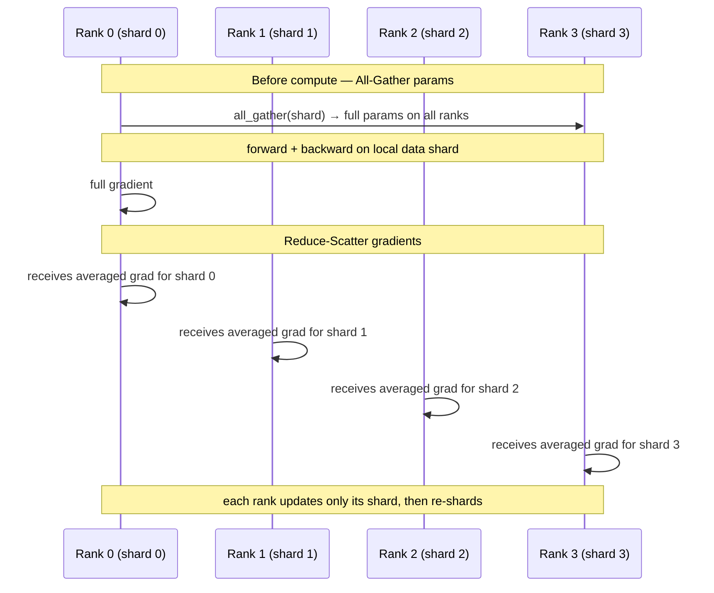

# ZeRO-3 / FSDP: Fully Sharded Data Parallel

> Flatten the whole model into one vector, shard it across ranks, and materialize parameters on demand with All-Gather; reduce-scatter gradients so each rank keeps only its shard.

## TL;DR

- ZeRO-1 shards optimizer state only; the full **parameters** still sit on every rank.
- ZeRO-3 / FSDP shards **parameters, gradients, and optimizer state** — each rank stores ~$1/N$ of each at rest.
- Per step: **All-Gather** shards → full params → forward/backward → **Reduce-Scatter** grads → each rank updates only its shard, then drops the full copy.
- This is the strategy behind PyTorch FSDP and DeepSpeed ZeRO-3, today's default for big-model training.

## The problem

ZeRO-1 still keeps a full replica of the parameters (and gradients) on every rank — fine for a few-billion-parameter model, fatal for hundreds of billions. ZeRO-3 removes the last redundancy: no rank ever holds the whole model at rest. Parameters live as a flat, evenly-sharded vector and are reconstructed *just in time* for compute, then immediately freed.

## Algorithm

1. **Flatten + pad**: concatenate every parameter into one vector, pad to a multiple of $N$, and give rank $r$ the $r$-th contiguous shard. (`flatten_params` / `pad_to_multiple` provided.)
2. **Materialize (All-Gather)**: before forward, `dist.all_gather` the shards and concat into the full flat vector; scatter it back into the model with `load_flat_into_model`.
3. **Local forward + backward**: each rank runs on its own data shard, producing a full gradient.
4. **Reduce-Scatter gradients**: split the full gradient into $N$ chunks and `dist.reduce_scatter(SUM)`; rank $r$ receives $\sum_i g_i^{(r)}$, then divide by $N$:
   $$\bar g^{(r)} = \frac{1}{N}\sum_{i=0}^{N-1} g_i^{(r)}$$
   which is exactly the $r$-th slice of the globally-averaged gradient.
5. **Sharded update**: each rank applies SGD to **only its shard** (real FSDP keeps only this shard's Adam $m/v$), then drops the full params — back to $1/N$ memory.

## Communication pattern



## What you'll see

Four ranks each report `params total=577 padded=580 | my shard=145 elems (1/4)`. Before implementation it stops at the first TODO:

```
NotImplementedError: TODO: all_gather_full_params -- hand-write the parameter All-Gather
```

Once both TODOs are correct, each step prints the local loss plus a `reduce_scatter err vs avg` that should be ~`1e-7` — proving your Reduce-Scatter equals the slice of a plain All-Reduce average.

## Your battle zone

Two functions in `1_data_parallel/6_fsdp_demo.py`:

1. **`all_gather_full_params(local_shard, world_size)`** — build a list of $N$ empty tensors on the same `device`, `dist.all_gather` the shards, `torch.cat` into the full flat vector.
2. **`reduce_scatter_grad(full_grad_flat, world_size)`** — split into $N$ contiguous chunks, `dist.reduce_scatter(out, chunks, op=SUM)`, return `out / world_size`.

## Run it

```bash
python 1_data_parallel/6_fsdp_demo.py
```

## Papers & further reading

- Rajbhandari et al., 2020, "ZeRO: Memory Optimizations Toward Training Trillion Parameter Models" (SC20).
- Zhao et al., 2023, "PyTorch FSDP: Experiences on Scaling Fully Sharded Data Parallel" (VLDB).
- Ren et al., 2021, "ZeRO-Offload: Democratizing Billion-Scale Model Training".
