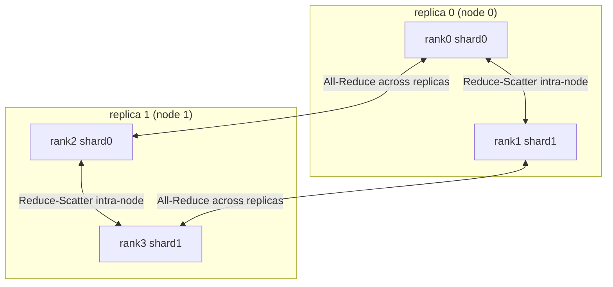

# HSDP: Hybrid Sharded Data Parallel

> Lay ranks on a 2D mesh — shard parameters with FSDP *inside* a group (fast intra-node links), replicate like DDP *across* groups (slow inter-node links). Gradients sync with Reduce-Scatter then All-Reduce.

## TL;DR

- Pure FSDP All-Gathers parameters across **all** ranks every step — that traffic crosses slow inter-node links at scale.
- HSDP confines the parameter All-Gather to a **shard group** (one node), and only an inter-node **gradient All-Reduce** crosses the replica dimension.
- Gradient sync = **Reduce-Scatter within the shard group** → **All-Reduce across the replica group** → divide by world size.
- This is `HYBRID_SHARD` in PyTorch FSDP.

## The problem

FSDP's memory win is paid for in bandwidth: every layer's parameters are gathered from every rank, twice per step (forward + backward). When ranks span many nodes, that All-Gather rides the slow inter-node fabric and stalls. HSDP keeps the heavy parameter traffic *intra-node* and lets the much smaller gradient sync be the only thing that crosses nodes — the standard recipe for multi-node big-model training.

## Algorithm

Arrange $N$ ranks as `SHARD × REPLICA` (replica-major: `rank = replica_idx * SHARD + shard_idx`).

1. **Shard group** (same `replica_idx`): FSDP-style parameter sharding lives here (intra-node, fast).
2. **Replica group** (same `shard_idx`): plain DDP replication across nodes.
3. **Gradient sync** (the battle zone), given the full local gradient:
   - **Reduce-Scatter** within the shard group (size `SHARD`): rank with `shard_idx = s` gets $\sum_{\text{shard grp}} g^{(s)}$.
   - **All-Reduce** across the replica group (size `REPLICA`): sum that shard over all replicas.
   - Divide by `world_size` → the global average gradient for shard $s$:
     $$\bar g^{(s)} = \frac{1}{N}\sum_{i=0}^{N-1} g_i^{(s)}$$

The two-step mesh sync gives the **identical** result to a global All-Reduce, but only the second step crosses nodes.

## Communication pattern



## What you'll see

Each rank prints its mesh coordinate, e.g. `mesh coord: replica=1, shard=0`. Before implementation:

```
NotImplementedError: TODO: hsdp_sync_grad -- reduce_scatter (shard) + all_reduce (replica)
```

When correct, every step prints `mesh-sync err vs global avg` ~`1e-7`, confirming the 2D mesh sync matches a plain global average.

## Your battle zone

One function in `1_data_parallel/6_hsdp_demo.py` — `hsdp_sync_grad(full_grad, shard_group, replica_group, shard_idx)`:

1. `dist.reduce_scatter(my, chunks, op=SUM, group=shard_group)` over `SHARD` chunks of the full gradient.
2. `dist.all_reduce(my, op=SUM, group=replica_group)`.
3. Return `my / WORLD_SIZE`.

The 2D process groups are pre-built in `build_mesh_groups` (note the collective `dist.new_group` gotcha: every rank must create every subgroup).

## Run it

```bash
python 1_data_parallel/6_hsdp_demo.py
```

## Papers & further reading

- Zhao et al., 2023, "PyTorch FSDP: Experiences on Scaling Fully Sharded Data Parallel" (VLDB) — `HYBRID_SHARD`.
- Rajbhandari et al., 2020, "ZeRO" (SC20).
- "ZeRO++: Extremely Efficient Collective Communication for Giant Model Training" (2023).
