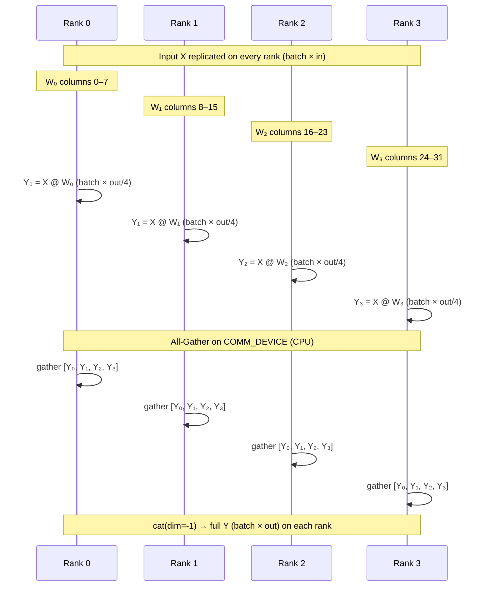

# Column Parallel Linear: All-Gather Concatenation

> Split a linear layer's weight along the output dimension, compute local column shards in parallel, then stitch the full output with All-Gather.

## TL;DR

- A linear $Y = X W$ with $W \in \mathbb{R}^{in \times out}$ is column-sharded: $W = [W_0 \mid W_1 \mid \cdots]$, each $W_i \in \mathbb{R}^{in \times out/n}$.
- Input $X$ is **replicated** on every rank; each rank computes $Y_i = X W_i \in \mathbb{R}^{batch \times out/n}$.
- Full output $Y = [Y_0 \mid Y_1 \mid \cdots]$ is assembled by **All-Gather** followed by `torch.cat(..., dim=-1)`.
- Typical use: first GEMM of an MLP or the QKV projection, so per-column nonlinearities stay local.

## The problem

A single linear layer with large output width (e.g. an MLP expansion or QKV projection) can exceed one device's memory. Tensor parallelism splits the weight matrix across ranks so each holds only a slice. In **column parallel**, the split is along the **output** dimension: every rank owns a disjoint set of output columns. Because the input is the same on all ranks, each can independently compute its slice of the output — but no single rank holds the full $Y$. You must communicate to reconstruct the complete result before downstream layers that expect full-width activations.

## Algorithm

Consider $Y = X W$ with shapes $X \in \mathbb{R}^{batch \times in}$, $W \in \mathbb{R}^{in \times out}$, $Y \in \mathbb{R}^{batch \times out}$, and `world_size` $= n$.

1. **Shard the weight (setup, provided)**: Build the full $W$ on every rank (same seed for cross-checking), then extract rank $r$'s column shard via `local_column_shard`:
   $$W_r = W[:, \; r \cdot out/n \;:\; (r+1) \cdot out/n] \in \mathbb{R}^{in \times out/n}.$$
2. **Replicate input**: $X \in \mathbb{R}^{batch \times in}$ is identical on all ranks (not sharded).
3. **Local GEMM**: Each rank computes
   $$Y_r = X W_r \in \mathbb{R}^{batch \times out/n}.$$
4. **All-Gather + concat**: Collect every rank's $Y_r$ and concatenate along the last dimension:
   $$Y = [Y_0 \mid Y_1 \mid \cdots \mid Y_{n-1}] \in \mathbb{R}^{batch \times out}.$$
   In PyTorch distributed terms: allocate a list of $n$ empty tensors (one per rank, each shaped like $Y_r$), call `dist.all_gather(gathered, y_local)`, then `torch.cat(gathered, dim=-1)`.

With `BATCH=8`, `IN_DIM=16`, `OUT_DIM=32`, and `WORLD_SIZE=4`, each rank holds $W_r$ of shape `(16, 8)` and produces $Y_r$ of shape `(8, 8)`.

## Communication pattern



## What you'll see

On launch, `launch_teaching_cluster` prints a banner with `world_size=4` and `backend=gloo`, then spawns four color-coded rank logs. Each rank reports its column shard shape, e.g. `holding column shard W_i = (16, 8)`. Before your implementation, the run stops at:

```
NotImplementedError: TODO: column_parallel_forward -- hand-write local matmul + All-Gather concat
```

After a correct implementation, rank 0 prints something like:

```
Column-parallel output shape = (8, 32) | max error vs single-machine = 1.19e-06
```

The demo builds the same full weight on every rank, computes a single-machine reference $Y_{\text{ref}} = X W$ on CPU, and reports the max absolute error against your distributed result. A correct All-Gather + concat should land near **~1e-6** (float32 noise).

## Your battle zone

Implement **`column_parallel_forward(x, w_shard, rank, world_size, device)`** in `2_tensor_parallel/column_parallel.py`. The skeleton raises `NotImplementedError`; you fill in:

1. **Local matmul**: `y_local = x @ w_shard` → shape `[BATCH, OUT_DIM / world_size]`.
2. **Prepare gather list**: `world_size` empty tensors on **`COMM_DEVICE`** (`cpu`), each matching `y_local`'s shape.
3. **All-Gather**: `dist.all_gather(gathered, y_local.to(COMM_DEVICE))`.
4. **Concatenate and return**: `torch.cat(gathered, dim=-1)`, move back to the MPS compute `device`.

Remember the golden rule: compute on MPS, move to **`COMM_DEVICE`** before gloo collectives, move back after.

## Run it

```bash
python 2_tensor_parallel/column_parallel.py
```

## Papers & further reading

- Shoeybi et al., 2019, "Megatron-LM: Training Multi-Billion Parameter Language Models Using Model Parallelism".
