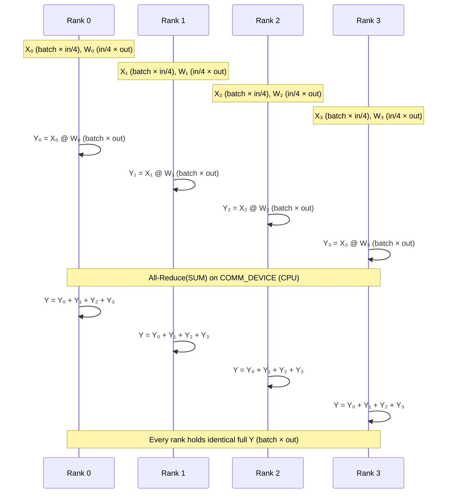

# Row Parallel Linear: All-Reduce Summation

> Split a linear layer's weight along the input dimension and the activations along the matching columns, then sum partial products with All-Reduce.

## TL;DR

- Same linear $Y = X W$, but **row split**: $W = [W_0; W_1; \cdots]$, each $W_i \in \mathbb{R}^{in/n \times out}$.
- Input is **column-sharded**: $X = [X_0 \mid X_1 \mid \cdots]$, each $X_i \in \mathbb{R}^{batch \times in/n}$, aligned with $W_i$.
- Because $X W = \sum_i X_i W_i$, each rank computes a full-shape partial $Y_i \in \mathbb{R}^{batch \times out}$ and **All-Reduce(SUM)** yields the global $Y$.
- Megatron chains column-parallel then row-parallel in an MLP so the two intermediate communications collapse to a single All-Reduce in forward (and one in backward).

## The problem

Column parallel splits the output and requires All-Gather to reassemble activations. The complementary **row parallel** split partitions $W$ along its **input** (row) dimension and shards $X$ along columns to match. Each rank computes only a partial contribution to the output, but critically every partial has the **full** output shape `[batch, out]`. Summing those partials recovers the exact result of the unsplit matmul — no concatenation needed. Row parallel is the natural second half of a Megatron MLP block: column parallel on the up-projection, row parallel on the down-projection, with communication folded into one All-Reduce per direction.

## Algorithm

Consider $Y = X W$ with $X \in \mathbb{R}^{batch \times in}$, $W \in \mathbb{R}^{in \times out}$, and `world_size` $= n$.

1. **Shard the weight (setup, provided)**: Build full $W$, then extract rank $r$'s row shard via `local_row_shard`:
   $$W_r = W[r \cdot in/n \;:\; (r+1) \cdot in/n, \; :] \in \mathbb{R}^{in/n \times out}.$$
2. **Shard the input**: Split $X$ by columns with `local_input_shard`:
   $$X_r = X[:, \; r \cdot in/n \;:\; (r+1) \cdot in/n] \in \mathbb{R}^{batch \times in/n}.$$
3. **Local GEMM (partial sum)**: Each rank computes
   $$Y_r = X_r W_r \in \mathbb{R}^{batch \times out}.$$
   Note: $Y_r$ has the **full** output shape, not a slice.
4. **All-Reduce(SUM)**: Sum partials across ranks:
   $$Y = \sum_{r=0}^{n-1} Y_r.$$
   After `dist.all_reduce(y_partial, op=dist.ReduceOp.SUM)`, every rank holds the identical full $Y$.

With `BATCH=8`, `IN_DIM=16`, `OUT_DIM=32`, and `WORLD_SIZE=4`, each rank holds $W_r$ of shape `(4, 32)`, $X_r$ of shape `(8, 4)`, and produces a partial $Y_r$ of shape `(8, 32)`.

## Communication pattern



## What you'll see

On launch, `launch_teaching_cluster` prints a banner with `world_size=4` and `backend=gloo`, then spawns four color-coded rank logs. Each rank reports its shard shapes, e.g. `holding row shard W_i = (4, 32) | input shard X_i = (8, 4)`. Before your implementation, the run stops at:

```
NotImplementedError: TODO: row_parallel_forward -- hand-write local partial sum + All-Reduce summation
```

After a correct implementation, rank 0 prints something like:

```
Row-parallel output shape = (8, 32) | max error vs single-machine = 1.19e-06
```

The demo computes a single-machine reference $Y_{\text{ref}} = X_{\text{full}} W_{\text{full}}$ and reports max absolute error. A correct All-Reduce sum should match within **~1e-6**.

## Your battle zone

Implement **`row_parallel_forward(x_shard, w_shard, rank, world_size, device)`** in `2_tensor_parallel/row_parallel.py`. The skeleton raises `NotImplementedError`; you fill in:

1. **Local matmul**: `y_partial = x_shard @ w_shard` → shape `[BATCH, OUT_DIM]` (full output shape on every rank).
2. **All-Reduce**: Move `y_partial` to **`COMM_DEVICE`** (`cpu`), then `dist.all_reduce(y_partial, op=dist.ReduceOp.SUM)`.
3. **Return**: Move the summed result back to the MPS compute `device`.

Unlike column parallel, there is no gather list or concatenation — one tensor in, one reduced tensor out. The `rank` argument is passed for symmetry with other demos but is unused in the forward itself.

## Run it

```bash
python 2_tensor_parallel/row_parallel.py
```

## Papers & further reading

- Shoeybi et al., 2019, "Megatron-LM: Training Multi-Billion Parameter Language Models Using Model Parallelism".
- Narayanan et al., 2021, "Efficient Large-Scale Language Model Training on GPU Clusters Using Megatron-LM" (SC21).
