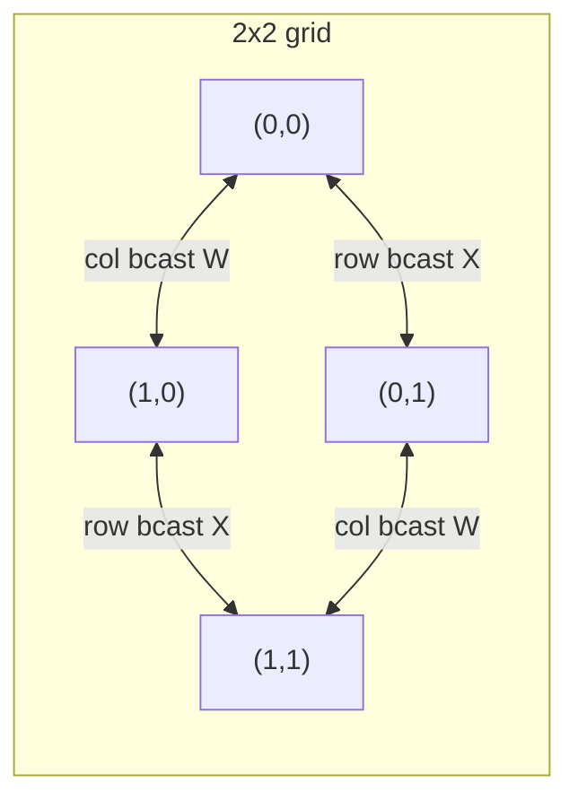

# 2D / 2.5D Tensor Parallel (SUMMA)

> Put ranks on a √N × √N grid and split both rows and columns of every matrix into blocks. A matmul becomes √N rounds of row/column broadcasts — comm confined to grid lines, not the whole world.

## TL;DR

- Megatron's 1D TP splits a weight along **one** axis; each rank holds a fat $1/\sqrt N$ slab and collectives span **all** $N$ ranks.
- 2D TP (SUMMA) splits **both** axes on a $q\times q$ grid ($q=\sqrt N$); each rank holds a $1/N$ block, and communication stays within row/column groups of size $q$.
- $Y = XW$ is computed in $q$ rounds: broadcast an $X$ block along the row, a $W$ block along the column, accumulate the partial product.
- 2.5D adds a replication `depth` to trade memory for even less communication.

## The problem

1D tensor parallelism scales communication volume with the number of ranks: every All-Reduce/All-Gather touches all $N$ ranks, and each holds a slab that shrinks only as $1/\sqrt N$ in one dimension. On large meshes this becomes the bottleneck. 2D parallelism borrows the classic **SUMMA** (Scalable Universal Matrix Multiplication Algorithm) idea from HPC: a 2D process grid where each collective is restricted to a single row or column.

## Algorithm

Grid of $q\times q$ ranks, `rank → (row = rank // q, col = rank % q)`. Block $X$ into $q\times q$ blocks $X_{ij}$ and $W$ into $W_{ij}$. Rank $(row, col)$ initially owns $X_{row,col}$ and $W_{row,col}$, and computes output block

$$Y_{row,col} = \sum_{k=0}^{q-1} X_{row,k}\, W_{k,col}.$$

SUMMA loop, for $k = 0 \dots q-1$:

1. The rank at column $k$ **broadcasts** $X_{row,k}$ along its **row group** (global src `row*q + k`).
2. The rank at row $k$ **broadcasts** $W_{k,col}$ along its **column group** (global src `k*q + col`).
3. Every rank accumulates `acc += X_block @ W_block`.

After $q$ rounds rank $(row,col)$ holds exactly $Y_{row,col}$.

## Communication pattern



## What you'll see

Each rank reports its grid cell and block shapes, e.g. `grid (1,0) | X blk=(4, 4) W blk=(4, 4)`. Before implementation:

```
NotImplementedError: TODO: summa_forward -- hand-write the 2D SUMMA broadcast/accumulate loop
```

When correct, every rank prints `max error vs single-machine` ~`1e-6` — its output block matches the matching block of the reference $XW$.

## Your battle zone

One function in `2_tensor_parallel/3_summa_2d.py` — `summa_forward(...)`: loop $k=0\dots q-1$, `dist.broadcast` the $X$ block within `row_group` (src `row*q+k`) and the $W$ block within `col_group` (src `k*q+col`), accumulate `x_buf @ w_buf`. The row/column groups are pre-built in `build_grid_groups`.

## Run it

```bash
python 2_tensor_parallel/3_summa_2d.py   # world_size must be a perfect square
```

## Papers & further reading

- Xu et al., 2021, "An Efficient 2D Method for Training Super-Large Deep Learning Models" (Colossal-AI 2D TP).
- Wang et al., 2021, "2.5-dimensional distributed model training" (Colossal-AI 2.5D).
- van de Geijn & Watts, 1997, "SUMMA: Scalable Universal Matrix Multiplication Algorithm".
