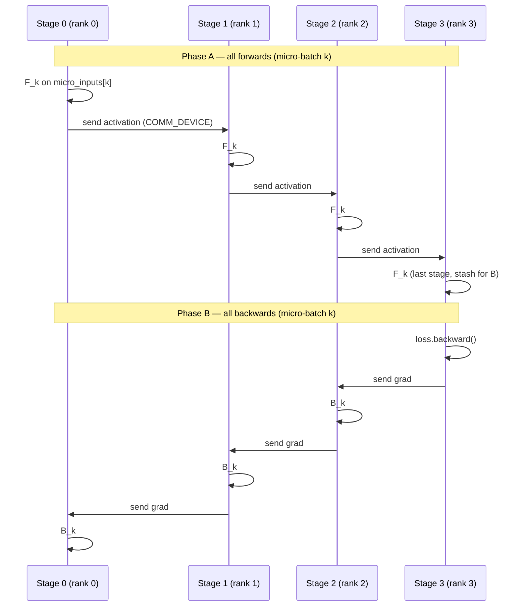

# GPipe: All-Forwards-Then-All-Backwards Pipeline Scheduling

> Split a model into layer stages across ranks, stream micro-batches through the pipeline, and schedule every forward before any backward — exposing the classic pipeline bubble.

## TL;DR

- Pipeline parallelism assigns one **stage** (subset of layers) per rank; rank 0 holds the first layers.
- A global batch is split into **M micro-batches** that flow stage-to-stage like an assembly line.
- **GPipe** runs Phase A (all M forwards), then Phase B (all M backwards) — the simplest F-then-B schedule.
- Forward activations travel **rank r → r+1**; gradients travel **rank r ← r+1**.
- With **p** stages and **m** micro-batches, the pipeline bubble fraction is $(p-1)/(m + p - 1)$; fewer micro-batches or more stages means a larger bubble.
- All **m** micro-batch activations stay alive until backward finishes — high peak activation memory (often mitigated by checkpointing).

## The problem

A model too large for one device is often split **by depth**: each rank owns a contiguous slice of layers. A single mini-batch would leave most ranks idle while one stage computes. GPipe injects **micro-batches** so multiple batches overlap in the pipe — but the naive F-then-B ordering still leaves ranks waiting during pipeline **fill** (early forwards with no backward yet) and **drain** (backwards with no new forwards). That idle time is the **pipeline bubble**. GPipe also defers every backward until all forwards complete, so every micro-batch's activations must remain in memory simultaneously. This demo makes both costs visible: hand-written point-to-point comm, a live Timeline, and staircase-shaped gaps in the Gantt chart.

## Algorithm

Let **p** = `world_size` (number of stages), **m** = `NUM_MICRO` (micro-batches). Rank 0 is the first stage; rank **p − 1** is the last.

1. **Shard inputs**: Rank 0 holds `micro_inputs[0..m−1]`; other ranks receive activations from their upstream neighbor.
2. **Phase A — all forwards** (for each micro-batch index `k` from 0 to m−1):
   - Rank 0: `x = micro_inputs[k]`.
   - Rank r > 0: `x = recv_tensor(..., src=r−1)` on MPS after the helper copies from `COMM_DEVICE`.
   - Compute `out = stage(x)` inside `timeline.span(rank, f"F{k}", kind="compute")`.
   - If not the last stage: `send_tensor(out, dst=r+1)`; else retain `out` for backward.
   - Stash each micro-batch's `(input, output)` pair — backward needs the saved graph.
3. **Phase B — all backwards** (for each `k`, flowing opposite to forward):
   - Last stage: form a scalar loss (e.g. `out.pow(2).mean()`), call `loss.backward()`.
   - Other stages: `recv` gradient from rank r+1, call `out.backward(grad)` inside `timeline.span(rank, f"B{k}", kind="compute")`.
   - If not rank 0: send the input tensor's `.grad` to rank r−1 via `send_tensor`.
4. **Bubble accounting**: In the limit of many steps, the fraction of time ranks spend idle (bubble) is
   $$\text{bubble fraction} = \frac{p - 1}{m + p - 1}.$$
   Example: p = 4, m = 4 → bubble = 3/7 ≈ 43%. Doubling m to 8 → 3/11 ≈ 27%.

## Communication pattern



Tensors compute on **MPS**; `send_tensor` / `recv_tensor` move data through **CPU** (`COMM_DEVICE`) because gloo point-to-point ops require CPU tensors.

## What you'll see

`launch_teaching_cluster(world_size=4, func=run)` spawns four processes. Each rank prints its stage id. Before your implementation, the run stops at:

```
NotImplementedError: TODO: gpipe_schedule -- hand-write the F-then-B pipeline schedule (raw send/recv)
```

After a correct `gpipe_schedule`, rank 0 prints an ASCII **Gantt chart** from `render_gantt(timeline, world_size)`. Compute spans are labeled `F0`, `F1`, … and `B0`, `B1`, …; idle gaps appear as **bubble** rows. GPipe's F-then-B produces prominent **staircase** bubbles — early ranks finish all forwards and wait; late ranks wait before their first forward and after their last backward.

Hand-drawn schedule sketch (p = 4 stages, m = 4 micro-batches; `F` = forward, `.` = bubble):

```
Stage0: F0 F1 F2 F3 .  .  .  B0 B1 B2 B3
Stage1: .  F0 F1 F2 F3 .  .  .  B0 B1 B2 B3
Stage2: .  .  F0 F1 F2 F3 .  .  .  B0 B1 B2 B3
Stage3: .  .  .  F0 F1 F2 F3 .  .  .  B0 B1 B2 B3
```

Rank 0's closing note points you to the next lesson: **1F1B** packs compute tighter by interleaving forwards and backwards.

## Your battle zone

Implement **`gpipe_schedule(rank, world_size, stage, micro_inputs, device, timeline)`** in `3_pipeline_parallel/1_gpipe.py`. The skeleton raises `NotImplementedError`; you fill in:

**Phase A — all forwards** (loop `m in range(NUM_MICRO)`):
- Rank 0 loads `micro_inputs[m]`; others `recv_tensor` from rank−1.
- Wrap `out = stage(x)` with `timeline.span(rank, f"F{m}")`.
- Send to rank+1 unless last stage; stash `(input, output)` for backward.
- Keep autograd alive (`requires_grad_(True)` on inputs as needed).

**Phase B — all backwards** (iterate micro-batches, reverse flow):
- Last stage: scalar loss on stashed output, then backward.
- Other stages: recv grad from rank+1, `out.backward(grad)`, send input grad to rank−1.
- Wrap each step with `timeline.span(rank, f"B{m}")`.

Use the provided **`send_tensor`** / **`recv_tensor`** helpers — do not call `dist.send`/`recv` on MPS tensors directly.

## Run it

```bash
python 3_pipeline_parallel/1_gpipe.py
```

## Papers & further reading

- Huang et al., 2019, "GPipe: Efficient Training of Giant Neural Networks using Pipeline Parallelism" (NeurIPS).
