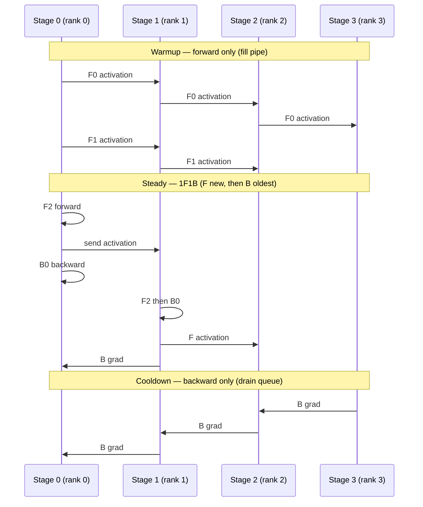

# 1F1B: One-Forward-One-Backward Pipeline Scheduling

> Interleave one micro-batch forward with one micro-batch backward in steady state — same asymptotic bubble as GPipe, but dramatically lower peak activation memory and tighter Gantt packing.

## TL;DR

- **GPipe** (F-then-B) keeps all **m** micro-batch activations alive until every backward finishes — memory scales with m and the bubble is large.
- **1F1B** (one-forward-one-backward) reaches a **steady state** where each stage, right after one forward, immediately runs one backward — freeing activations promptly.
- Three phases per rank: **Warmup** (forward-only fill), **Steady** (alternate F then B), **Cooldown** (remaining backwards).
- Warmup count: `num_warmup = min(world_size - 1 - rank, NUM_MICRO)` — earlier stages fill more of the pipe.
- Peak in-flight micro-batches is **O(p)** instead of **O(m)**; this is the key win (PipeDream-Flush / Megatron-LM).
- Asymptotic bubble fraction remains $(p-1)/(m + p - 1)$, but compute blocks pack tighter on the Timeline.
- This demo uses `NUM_MICRO=8` so steady-state interleaving is easy to see.

## The problem

GPipe's simplicity comes at two costs: a large **pipeline bubble** during fill and drain, and **activation memory** proportional to the number of micro-batches — every forward output must survive until Phase B. Production pipeline training (Megatron-LM, PipeDream-Flush) instead drives the pipe to **steady state** where forwards and backwards overlap: as soon as a stage finishes forwarding micro-batch *k*, it can backward micro-batch *k − (p − 1)* (roughly), because that batch has cleared downstream stages. Activations are freed after at most **p** in-flight micro-batches per stage. The asymptotic bubble formula is unchanged, but wall-clock utilization improves and memory becomes **stable** rather than growing with m. This demo implements that three-phase state machine with the same `Stage`, `send_tensor`/`recv_tensor`, and Timeline instrumentation as GPipe.

## Algorithm

Let **p** = `world_size`, **m** = `NUM_MICRO`, **w** = `num_warmup = min(p − 1 − rank, m)`.

1. **Warmup** (w iterations): Forward-only. Inject w micro-batches to fill the pipeline. Rank 0 uses `micro_inputs[0..w−1]`; downstream ranks recv from rank−1. Push each `(input, output)` onto a **queue** awaiting backward. Forward direction: **rank r → r+1**.
2. **Steady** (`m − w` iterations): For each step:
   - **Forward one** new micro-batch (index advances).
   - **Backward one** oldest queued micro-batch (FIFO).
   This alternation *is* 1F1B. At most ~**p** micro-batches are in-flight per stage.
3. **Cooldown** (w iterations): No new forwards; drain the queue with backward-only steps. Gradient direction: **rank r ← r+1** (same as GPipe).
4. **Bubble fraction** (asymptotic, same as GPipe):
   $$\text{bubble fraction} = \frac{p - 1}{m + p - 1}.$$
   With p = 4, m = 8 → 3/11 ≈ 27%. The win is **memory** and **overlap**, not a different formula.

## Communication pattern



As in GPipe, compute runs on **MPS**; `send_tensor` / `recv_tensor` shuttle through **`COMM_DEVICE`** (CPU) for gloo compatibility.

## What you'll see

`launch_teaching_cluster(world_size=4, func=run)` spawns four ranks. Each prints `warmup micro-batches = …` (rank 0 → 3, rank 3 → 0). Before your implementation:

```
NotImplementedError: TODO: one_f_one_b_schedule -- hand-write the 3-phase 1F1B state machine (raw send/recv)
```

After a correct schedule, ranks emit a live **conveyor log** via `log_state(rank, "F3")` / `log_state(rank, "B1")` — cyan for forwards, magenta for backwards. Rank 0 prints the ASCII **Gantt** from `render_gantt`. Compared to GPipe, compute blocks **pack tighter** with smaller staircase gaps; bubbles shrink because fill and drain overlap with steady-state 1F1B.

Hand-drawn steady-state sketch (p = 4, m = 8; later timesteps show F/B interleaving):

```
Stage0: F0 F1 F2 F3 B0 F4 B1 F5 B2 F6 B3 F7 B4 B5 B6 B7
Stage1: .  F0 F1 F2 B0 F3 B1 F4 B2 F5 B3 F6 B4 F7 B5 B6 B7
Stage2: .  .  F0 F1 B0 F2 B1 F3 B2 F4 B3 F5 B4 F6 B5 F7 B6 B7
Stage3: .  .  .  F0 B0 F1 B1 F2 B2 F3 B3 F4 B4 F5 B5 F6 B6 F7 B7
```

Compare side-by-side with `1_gpipe.py`'s dashboard to see the tighter packing.

## Your battle zone

Implement **`one_f_one_b_schedule(rank, world_size, stage, micro_inputs, device, timeline)`** in `3_pipeline_parallel/2_one_forward_backward.py`. Maintain a **queue** of forwarded micro-batches awaiting backward. Suggested inner helpers:

- **`forward_one(m)`**: get/recv input → `stage(x)` → `log_state(rank, f"F{m}")` → `timeline.span(rank, f"F{m}")` → send to rank+1 or enqueue `(input, output)`.
- **`backward_one(m)`**: last stage forms loss / others recv grad from rank+1 → `out.backward(grad)` → `log_state(rank, f"B{m}")` → `timeline.span(rank, f"B{m}")` → send input grad to rank−1.

Three phases:
1. **Warmup**: loop `num_warmup` times — `forward_one` only.
2. **Steady**: loop `NUM_MICRO - num_warmup` times — `forward_one` then `backward_one`.
3. **Cooldown**: backward remaining queue entries.

Comm direction matches GPipe: forward **r → r+1**, backward **r ← r+1**, via `send_tensor` / `recv_tensor` on `COMM_DEVICE`.

## Run it

```bash
python 3_pipeline_parallel/2_one_forward_backward.py
```

## Papers & further reading

- Narayanan et al., 2019, "PipeDream: Generalized Pipeline Parallelism for DNN Training" (SOSP).
- Narayanan et al., 2021, "Efficient Large-Scale Language Model Training on GPU Clusters Using Megatron-LM" (SC21) (1F1B / PipeDream-Flush).
- Fan et al., 2021, "DAPPLE: A Pipelined Data Parallel Approach for Training Large Models".
