# Interleaved 1F1B (Megatron Virtual Pipeline)

> Give each rank V non-contiguous "virtual" stages instead of one, so the pipeline behaves as if it had p·V stages — shrinking the bubble by ~1/V.

## TL;DR

- Plain 1F1B's bubble is $(p-1)/(m+p-1)$; it shrinks with deeper pipelines, but you only have $p$ physical ranks.
- Interleaved 1F1B assigns each rank **V virtual chunks** round-robin, making the effective depth $p\cdot V$.
- Deeper effective pipeline → steady state reached sooner → bubble drops by ~$1/V$.
- Cost: $V\times$ more pipeline point-to-point messages.

## The problem

The pipeline bubble is fundamentally "fill + drain" idle time proportional to the number of stages $p$. With only $p$ GPUs you can't add real stages — but you *can* slice the model into $p\cdot V$ layer-chunks and scatter them round-robin so each rank owns $V$ of them. A micro-batch then traverses $p\cdot V$ virtual stages, bouncing across the ranks $V$ times. This is Megatron-LM's "virtual pipeline" / interleaved schedule.

## Algorithm

Global virtual stage $s \in [0, p\cdot V)$ lives on rank $s \bmod p$ as that rank's chunk $s // p$. So rank $r$ owns chunks $\{r, r+p, r+2p, \dots\}$.

- **Warmup**: forward-only, deeper than plain 1F1B — `num_warmup ≈ (p-1-rank) + (V-1)·p`, interleaving the chunks in Megatron's deterministic order to fill the longer pipe.
- **Steady**: one forward (next chunk in order) immediately followed by one backward (oldest pending activation, reverse chunk order).
- **Cooldown**: drain the remaining backwards.

Per-chunk activation queues track forwarded-but-not-yet-backward micro-batches; `global_stage(rank, chunk, world_size)` tells you whether a chunk is the first global stage (read inputs) or last (start backward from a local loss).

## Communication pattern

```mermaid
sequenceDiagram
    participant R0 as Rank 0 (chunks 0,4)
    participant R1 as Rank 1 (chunks 1,5)
    participant R2 as Rank 2 (chunks 2,6)
    participant R3 as Rank 3 (chunks 3,7)
    Note over R0,R3: a micro-batch climbs all 8 virtual stages
    R0->>R1: stage0 → stage1
    R1->>R2: stage1 → stage2
    R2->>R3: stage2 → stage3
    R3->>R0: stage3 → stage4 (back to rank0, chunk 1!)
    R0->>R1: stage4 → stage5
    Note over R0,R3: interleaving chunks keeps every rank busier → smaller bubble
```



## What you'll see

Each rank reports the virtual stages it owns, e.g. `owns virtual chunks [0, 4] of 8`. Before implementation:

```
NotImplementedError: TODO: interleaved_schedule -- hand-write the virtual-pipeline 1F1B state machine
```

When you implement the schedule, the `[c0:F3]` / `[c1:B1]` conveyor log and the `render_gantt` timeline should show a **tighter** packing than `one_forward_backward.py`.

## Your battle zone

`interleaved_schedule(...)` in `3_pipeline_parallel/interleaved_1f1b.py`: the warmup / steady / cooldown state machine advancing $V$ virtual chunks per rank, using `send_tensor` / `recv_tensor`, `log_state(rank, chunk, tag)`, and `timeline.span(...)`.

## Run it

```bash
python 3_pipeline_parallel/interleaved_1f1b.py
```

## Papers & further reading

- Narayanan et al., 2021, "Efficient Large-Scale Language Model Training on GPU Clusters Using Megatron-LM" (SC21) — interleaved/virtual pipeline.
- Huang et al., 2019, "GPipe".
- Narayanan et al., 2019, "PipeDream".
