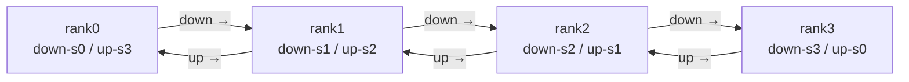

# Chimera: Bidirectional Pipeline

> Run two pipelines in opposite directions at once, with each rank holding one stage from each. When one pipeline would idle a rank, the other gives it work — halving the bubble. The academic ancestor of DeepSeek DualPipe.

## TL;DR

- A single 1F1B pipeline's bubble can't drop below $(p-1)/(m+p-1)$ and flows one way.
- Chimera runs a **down** pipeline and an **up** pipeline simultaneously; each rank owns down-stage $r$ **and** up-stage $p-1-r$.
- The two pipelines fill each other's bubbles → roughly **halved** bubble, balanced memory.
- The two stage copies per rank are replicas → their gradients are All-Reduced before the step.

## The problem

1F1B leaves fill/drain idle time that grows with pipeline depth, and only ever moves activations one direction. Chimera (SC'21) observed that a *second* pipeline flowing the opposite way can use exactly the slots the first leaves idle. By co-locating one stage of each direction on every rank, both pipelines keep the rank busy — the predecessor idea that DeepSeek-V3's DualPipe later pushed to near-zero bubble with comm/compute overlap.

## Algorithm

For pipeline depth $p$:

- **Down pipeline**: stage $s$ on rank $s$; flows rank $0 \to p-1$ (forward), backward $r \leftarrow r+1$.
- **Up pipeline**: stage $s$ on rank $p-1-s$; flows rank $p-1 \to 0$.
- So rank $r$ holds **down-stage $r$** and **up-stage $p-1-r$**. Micro-batches are split into two groups, one per pipeline.

Schedule: run both as interleaved 1F1B state machines on each rank (down warmup $= p-1-r$, up warmup $= r$), alternating a down step and an up step so the rank is busy whenever *either* pipeline has work. The down tail is rank $p-1$, the up tail is rank $0$ (each builds a local loss to start backward). After both pipelines drain, **All-Reduce the two replicas' gradients** (`sync_replica_grads`, provided).

## Communication pattern



## What you'll see

Each rank reports its two stages, e.g. `holds down-stage 1 and up-stage 2`. Before implementation:

```
NotImplementedError: TODO: chimera_schedule -- hand-write the two combined opposing pipelines
```

When implemented, the `[D:F2]` / `[U:B1]` conveyor log and `render_gantt` timeline should show a bubble roughly half that of `2_one_forward_backward.py`, and visibly the bidirectional shape that `6_deepseek_dualpipe.py` refines.

## Your battle zone

`chimera_schedule(...)` in `3_pipeline_parallel/5_chimera.py`: interleave the down and up 1F1B pipelines (per-direction pending queues, `send_tensor`/`recv_tensor` in the right directions), then call `sync_replica_grads(down_stage, up_stage, world_size)`.

## Run it

```bash
python 3_pipeline_parallel/5_chimera.py
```

## Papers & further reading

- Li & Hoefler, 2021, "Chimera: Efficiently Training Large-Scale Neural Networks with Bidirectional Pipelines" (SC21).
- DeepSeek-AI, 2024, "DeepSeek-V3 Technical Report" — DualPipe, Chimera's descendant.
- Narayanan et al., 2021, Megatron-LM interleaved pipeline (SC21).
