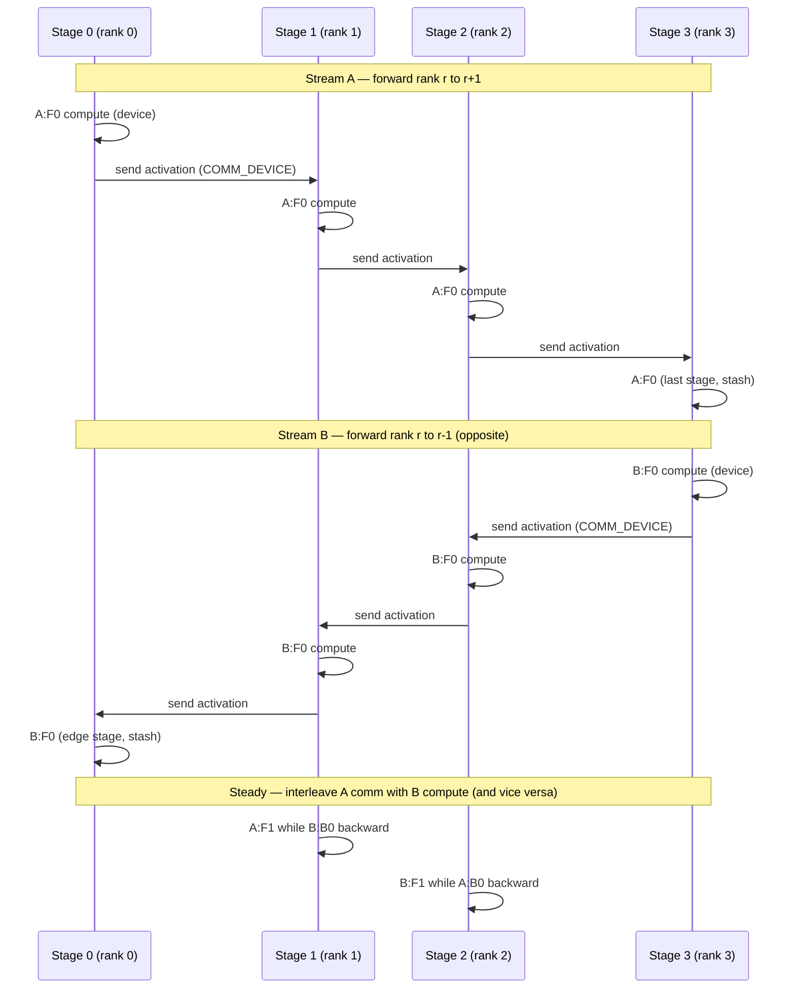

# DeepSeek DualPipe: Bidirectional Pipeline Parallelism

> Feed two micro-batch streams through the pipeline in opposite directions so each stage's idle bubble is filled by the other stream's work — nearly eliminating pipeline bubbles at the cost of two in-flight copies.

## TL;DR

- **1F1B** runs one direction and still has a $(p-1)/(m+p-1)$ pipeline bubble during fill and drain.
- **DualPipe** (DeepSeek-V3) feeds **two** micro-batch streams from **opposite ends**: stream **A** flows stage 0 → p−1, stream **B** flows stage p−1 → 0.
- Each stage always has work from one direction to fill what would be the other's bubble; overlapping point-to-point comm with compute shrinks the bubble further.
- Trade-off: two copies of params/activations in flight — in DeepSeek-V3 this is paired with **MoE** so expert all-to-all of one chunk hides behind attention/MLP compute of another.
- Warmup counts: stream A = `world_size - 1 - rank`, stream B = `rank`; three phases (warmup / steady / cooldown) mirror 1F1B but for **both** directions, interleaved.
- This demo is a **scheduling skeleton** — schedule **shape** matters more than numerics.
- Demos launch via `launch_teaching_cluster(world_size, func)`; compute on the **`device`**, send/recv route through **`COMM_DEVICE`** (the comm device).

## The problem

1F1B dramatically cuts peak activation memory versus GPipe, but the asymptotic bubble fraction is unchanged: $(p-1)/(m+p-1)$. During warmup and cooldown, stages at one end of the pipe still sit idle while the other end fills or drains. DeepSeek-V3's **DualPipe** attacks that idle time directly: instead of one conveyor belt, run **two** belts in opposite directions through the same stage stack. While stream A's activation is in flight toward higher ranks, stream B's chunk can compute on the same stage — and vice versa. The result is a timeline where bubble gaps nearly vanish, at the price of holding **two** parameter/activation copies per stage. In production, DualPipe is combined with MoE so communication from one stream hides behind compute from the other. This teaching demo strips that down to the bidirectional 1F1B-style state machine and a `Timeline` + ASCII Gantt so you can **see** the bubble shrink versus `1_gpipe.py` and `2_one_forward_backward.py`.

## Algorithm

Let **p** = `world_size`, **m** = `NUM_MICRO` (micro-batches **per direction**), rank 0 = first stage, rank **p − 1** = last stage.

1. **Two streams**: Stream **A** forward direction rank r → r+1 (inputs on rank 0). Stream **B** forward direction rank r → r−1 (inputs on rank p−1). Backward for each stream flows the opposite way.
2. **Warmup** (per direction, forward-only fill):
   - Stream A: `warmup_a = min(p − 1 − rank, m)` forwards.
   - Stream B: `warmup_b = min(rank, m)` forwards.
   Tag spans `A:F{k}` / `B:F{k}`; enqueue stashed `(input, output)` pairs per stream.
3. **Steady** (`m − warmup` iterations per direction): For **both** streams each step, run one forward **and** one backward — but **interleave** A and B so comm on one stream overlaps compute on the other. This is the core DualPipe win: the bubble one direction would leave is filled by the other direction's work.
4. **Cooldown**: Drain remaining backwards for both streams (no new forwards). Tag `A:B{k}` / `B:B{k}`.
5. **Bubble accounting**: 1F1B retains $(p-1)/(m+p-1)$ asymptotically. DualPipe drives utilization toward **full** by bidirectional fill — the Gantt should show a **smaller** idle fraction than GPipe/1F1B for the same p and m, even though this demo does not numerically verify bubble ratios.

## Communication pattern



Tensors compute on the **`device`**; `send_tensor` / `recv_tensor` move data through **`COMM_DEVICE`** (the comm device), so the same code works under gloo and NCCL.

## What you'll see

`launch_teaching_cluster(world_size=4, func=run)` spawns four processes. Each rank prints `streamA warmup = …, streamB warmup = …` (rank 0 has A-warmup 3 and B-warmup 0; rank 3 is the mirror). Before your implementation, the run stops at:

```
NotImplementedError: TODO: dualpipe_schedule -- hand-write the bidirectional pipeline state machine
```

After a correct schedule, ranks emit a live conveyor log via `log_state(rank, "A:F2")` / `log_state(rank, "B:B1")` — cyan for forwards, magenta for backwards. Rank 0 prints the ASCII **Gantt chart** from `render_gantt(timeline, world_size)`. Compared to GPipe and 1F1B, compute blocks pack tighter with **smaller bubble rows** because opposing streams fill each other's gaps.

Hand-drawn schedule sketch (p = 4, m = 6 per direction; tags match `log_state`; `.` = idle gap — should be rarer than 1F1B):

```
Stage0: A:F0 A:F1 A:F2 B:B5 B:B4 A:F3 B:B3 A:F4 B:B2 A:F5 B:B1 B:B0 A:B0 A:B1 A:B2
Stage1: B:F0 A:F0 B:F1 A:F1 B:F2 A:F2 B:F3 A:F3 B:F4 A:F4 B:F5 A:F5 A:B* B:B*
Stage2: A:F0 B:F0 A:F1 B:F1 A:F2 B:F2 A:F3 B:F3 A:F4 B:F4 A:F5 B:F5 A:B* B:B*
Stage3: A:F0 B:F0 B:F1 A:F1 B:F2 A:F2 B:F3 A:F3 B:F4 A:F4 B:F5 A:F5 B:B* A:B*
```

This is a **scheduling skeleton** — there is no numeric correctness check; the goal is a valid bidirectional schedule whose Gantt **shape** shows both streams completing with less bubble than single-direction GPipe/1F1B.

## Your battle zone

Implement **`dualpipe_schedule(rank, world_size, stage, micro_inputs_a, micro_inputs_b, device, timeline)`** in `3_pipeline_parallel/6_deepseek_dualpipe.py`. The skeleton raises `NotImplementedError` at `# TODO(you)`; you fill in the bidirectional warmup / steady / cooldown state machine.

Suggested inner helpers:

- **`fwd_a(m)`** / **`bwd_a(m)`**: stream A uses `send_tensor(..., rank+1)` forward and recv from rank−1; rank 0 starts from `micro_inputs_a`; rank p−1 forms loss on backward.
- **`fwd_b(m)`** / **`bwd_b(m)`**: stream B uses `send_tensor(..., rank−1)` forward and recv from rank+1; rank p−1 starts from `micro_inputs_b`; rank 0 forms loss on backward.

Three phases for **each** stream, interleaved:

1. **Warmup**: forward-only per stream (`A:F{m}` / `B:F{m}`) for `warmup_a` and `warmup_b` counts.
2. **Steady**: each iteration advances both streams — one forward and one backward per direction, interleaved so comm on one stream overlaps compute on the other.
3. **Cooldown**: drain remaining backwards (`A:B{m}` / `B:B{m}`).

Wrap each compute chunk with `timeline.span(rank, tag)` and call `log_state(rank, tag)`. Use provided **`send_tensor`** / **`recv_tensor`** — they handle the `COMM_DEVICE` hop for you. Correctness of the schedule **shape** (both streams complete, smaller timeline bubble than gpipe/1f1b) matters more than perfect numerics.

## Run it

```bash
python 3_pipeline_parallel/6_deepseek_dualpipe.py
```

## Papers & further reading

- DeepSeek-AI, 2024, "DeepSeek-V3 Technical Report" (DualPipe algorithm).
- Qi et al., 2023, "Zero Bubble Pipeline Parallelism".
- Narayanan et al., 2021, "Efficient Large-Scale Language Model Training on GPU Clusters Using Megatron-LM" (1F1B baseline).
