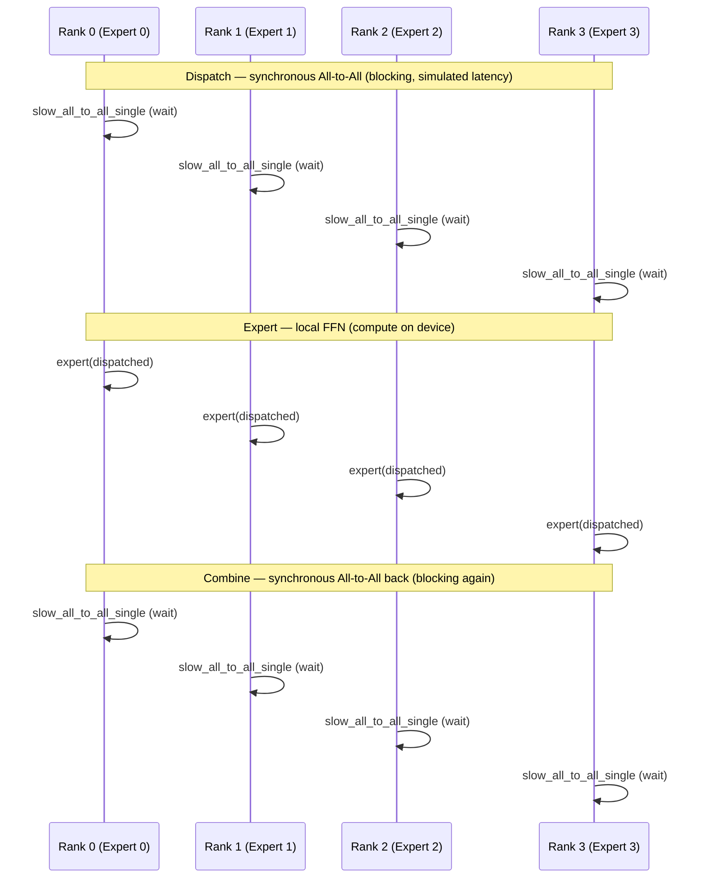

# Serial MoE: Synchronous All-to-All (Naive Baseline)

> Each rank hosts one expert; tokens dispatch and combine via blocking All-to-All while compute units idle through simulated cross-machine latency.

## TL;DR

- **Mixture of Experts (MoE)**: each rank owns one FFN expert; tokens route to the rank hosting their target expert.
- Three steps: **Dispatch** (All-to-All) → **Expert** (local FFN) → **Combine** (All-to-All back).
- This demo uses **synchronous** `slow_all_to_all_single` — comm and compute are fully serialized.
- Total time ≈ **comm + compute**; simulated latency is hidden not at all.
- Balanced routing (`TOKENS_PER_EXPERT` tokens per expert) makes equal-split All-to-All map to dispatch-by-expert.

## The problem

MoE scales model capacity by activating only a subset of experts per token. In distributed training, experts are **sharded across ranks**: rank *e* hosts expert *e*. A token destined for expert 2 must leave its origin rank and arrive at rank 2 before the FFN runs; the result must travel back.

That routing is implemented with **All-to-All** — twice per forward pass (dispatch and combine). On real clusters, those collectives cross machines over IB NICs with measurable latency. The serial (naive) schedule fires dispatch, **blocks until every byte arrives**, runs expert compute, then blocks again on combine. During each communication phase, GPUs sit idle. Expert compute and network transfer never overlap, so makespan grows as the sum of both costs. This demo makes that pain explicit with injected 20 ms latency per transfer so you can feel it on a Mac.

## Algorithm

Assume **world_size** = *E* experts (one per rank). Each rank holds local tokens shaped `[E × TOKENS_PER_EXPERT, DIM]`, segmented so rows `[e × T : (e+1) × T)` are tokens routed to expert *e* (balanced routing).

1. **Dispatch** — All-to-All sends each segment to the rank hosting the target expert:
   - Input: local tokens on rank *r*.
   - Collective: **All-to-All** (equal split).
   - Output: `dispatched` on rank *r* — all tokens from the cluster destined for expert *r*.
2. **Expert** — Local FFN forward on received tokens:
   $$y = \mathrm{ReLU}(W x + b)$$
   Computed on the **`device`**; only the tokens this rank's expert owns.
3. **Combine** — All-to-All sends expert outputs back to origin ranks:
   - Input: expert outputs (same segmented layout).
   - Collective: **All-to-All** (reverse routing).
   - Output: `combined` — each rank receives results for its original tokens.

Serial schedule: step 1 completes fully, then step 2, then step 3. No overlap between comm phases and compute.

## Communication pattern



Dispatch, compute, and combine all run on the same **`device`**.

## What you'll see

`launch_teaching_cluster(world_size=4, func=run)` prints a banner with four color-coded rank logs. Each rank reports local token shape and simulated link latency (20 ms/transfer). Before your implementation, the run stops at:

```
NotImplementedError: TODO: naive_moe_forward -- hand-write synchronous serial dispatch/expert/combine
```

After a correct implementation, rank 0 prints:

```
naive MoE makespan = XXX.X ms (comm and compute fully serialized)
```

The **Timeline** records spans with `kind="comm"` for dispatch/combine and `kind="compute"` for expert — strictly back-to-back with idle gaps during comm. Note this makespan; **2_lightning_moe.py** compares against it with an ASCII bar via `bar(value, total)`.

With `DEFAULT_LINK` at 20 ms and two All-to-Alls per forward, comm alone contributes ~40 ms per rank before expert time — the baseline lightning MoE tries to crush.

## Your battle zone

Implement **`naive_moe_forward(rank, world_size, expert, tokens, device, timeline)`** in `4_expert_parallel/1_naive_moe.py`. The skeleton currently raises `NotImplementedError` at the `# TODO(you)` marker.

1. **Dispatch** (synchronous):
   - `dispatched = torch.empty_like(tokens)`
   - Wrap `slow_all_to_all_single(dispatched, tokens, DEFAULT_LINK)` in `timeline.span(rank, "dispatch", kind="comm")`.
2. **Expert** (compute on `device`):
   - Wrap `out = expert(dispatched)` in `timeline.span(rank, "expert", kind="compute")`.
3. **Combine** (synchronous):
   - `combined = torch.empty_like(out)`
   - Wrap `slow_all_to_all_single(combined, out, DEFAULT_LINK)` in `timeline.span(rank, "combine", kind="comm")`.
4. Return `combined`.

Dispatch, compute, and combine all run on the same **`device`**. The three steps must be strictly serial — zero overlap.

## Run it

```bash
python 4_expert_parallel/1_naive_moe.py
```

## Papers & further reading

- Shazeer et al., 2017, "Outrageously Large Neural Networks: The Sparsely-Gated Mixture-of-Experts Layer".
- Lepikhin et al., 2020, "GShard: Scaling Giant Models with Conditional Computation and Automatic Sharding".
- Fedus et al., 2021, "Switch Transformers: Scaling to Trillion Parameter Models with Simple and Efficient Sparsity".
