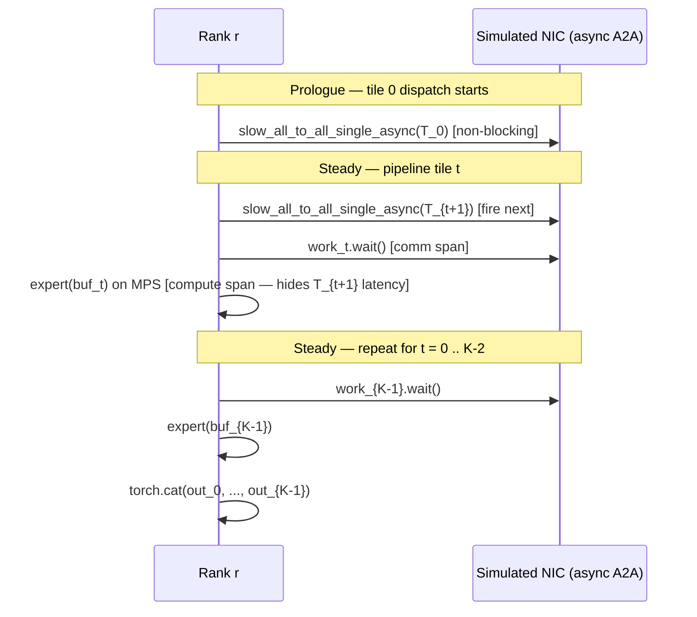

# Lightning MoE: Tile Overlap (Comm-Compute Pipeline)

> Split the token batch into tiles and pipeline async All-to-All with expert compute so communication latency hides behind FFN work.

## TL;DR

- **naive MoE** separates comm and compute — total time ≈ comm + compute.
- **Lightning MoE** splits tokens into **NUM_TILES** tiles and pipelines them: while tile *t*'s expert runs, tile *t+1*'s All-to-All is already in flight.
- Uses `slow_all_to_all_single_async` + a software pipeline (prologue / steady / epilogue).
- Total time ≈ **max(total comm, total compute)** when compute is large enough to cover latency.
- Larger simulated latency and more tiles → bigger speedup over naive.

## The problem

Naive MoE dispatches **all** tokens, waits for the full cross-machine latency, computes **all** expert outputs, then waits again on combine. Communication and compute are cleanly separated — and during every All-to-All, compute units stare at the network.

Production MoE systems (MegaScale, Tutel, FasterMoE) attack this with **Tile overlap**: treat the batch as a sequence of smaller tiles and overlap async dispatch with expert compute. By the time tile *t*'s FFN finishes on MPS, tile *t+1*'s data has roughly arrived. The communication bubble gets filled by useful compute. This demo implements that micro-pipeline by hand so you can measure the makespan gap against naive_moe on the same simulated 20 ms link.

## Algorithm

Same MoE semantics as naive (dispatch → expert → combine), but the token batch is chunked with **`split_tiles(tokens, NUM_TILES)`** along the token dimension. Each tile preserves the segmented-by-expert layout; `NUM_TILES` must divide `TOKENS_PER_EXPERT` so equal-split All-to-All stays valid per tile.

Let tiles be $T_0, \ldots, T_{K-1}$ with $K$ = `NUM_TILES`.

1. **Prologue** — Fire async dispatch for tile 0:
   - `buf_0 = empty_like(T_0)` on COMM_DEVICE
   - `work_0 = slow_all_to_all_single_async(buf_0, T_0)`
2. **Steady state** — For each tile index $t \in [0, K)$:
   - If $t + 1 < K$, immediately fire async dispatch for tile $t+1$ (comm in flight).
   - `work_t.wait()` inside a comm timeline span — tops up remaining simulated latency.
   - `out_t = expert(buf_t.to(device))` inside a compute span — **this compute covers tile $t+1$'s in-flight latency**.
   - Stash `out_t`.
3. **Epilogue** — `torch.cat` all `out_t` along the token dim; optionally pipeline combine the same way (get dispatch overlap working first).

Contrast with naive: in naive, `wait()` immediately follows send with nothing to do; here, before `wait()` the next tile's comm is already flying and a large compute chunk follows — latency is eaten by overlap.

## Communication pattern



Each rank runs this pipeline independently; All-to-All is a collective, but the **overlap pattern** is per-rank software scheduling.

## What you'll see

`launch_teaching_cluster(world_size=4, func=run)` spawns four processes. Each rank prints local token shape and `NUM_TILES = 4`. Before your implementation:

```
NotImplementedError: TODO: lightning_moe_forward -- hand-write the Tile-level async comm-compute overlap pipeline
```

After a correct pipeline, rank 0 prints:

```
lightning MoE makespan = XXX.X ms (comm overlapped with compute)
```

Then **`print_compare_bar`** draws an ASCII comparison using **`bar(value, total)`**:

```
  -- Comm-bubble fill effect (shorter is better) --
  naive     |####################----------------|  180.0 ms
  lightning |##########--------------------------|  100.0 ms
  Tile Overlap saved ~44% of the time -- comm latency hidden behind compute!
```

Plug in the real naive makespan from `naive_moe.py` (the demo ships a placeholder multiplier until you run both). Timeline spans should show comm waits **shorter** relative to compute when overlap works — comm `wait()` time is reduced by elapsed compute.

## Your battle zone

Implement **`lightning_moe_forward(rank, world_size, expert, tokens, device, timeline)`** in `4_expert_parallel/lightning_moe.py`. The `# TODO(you)` currently raises `NotImplementedError`.

Use **`split_tiles(tokens, NUM_TILES)`** to chunk the batch. Pattern:

```python
tiles = split_tiles(tokens, NUM_TILES)
# Prologue: buf0 on COMM_DEVICE, work0 = slow_all_to_all_single_async(buf0, tiles[0])
# Steady loop over t:
#   - fire async dispatch for tiles[t+1] if it exists
#   - timeline.span(..., kind="comm"): work_t.wait()
#   - timeline.span(..., kind="compute"): out_t = expert(buf_t.to(device))
# Epilogue: return torch.cat(out_list, dim=0)  # extend with combine pipeline if desired
```

Key imports: `slow_all_to_all_single_async`, `DEFAULT_LINK` from `topology_sim`; **`COMM_DEVICE`** from `env_setup` for all All-to-All buffers. Compute stays on **MPS** (`device`).

Constants: `WORLD_SIZE=4`, `TOKENS_PER_EXPERT=32`, `NUM_TILES=4`, `DIM=64`.

## Run it

```bash
python 4_expert_parallel/lightning_moe.py
```

Run **`naive_moe.py`** first and paste its makespan into `print_compare_bar` for a real side-by-side bar.

## Papers & further reading

- Hwang et al., 2022, "Tutel: Adaptive Mixture-of-Experts at Scale".
- He et al., 2022, "FasterMoE: Modeling and Optimizing Training of Large-Scale Dynamic Pre-Trained Models".
- Jiang et al., 2024, "MegaScale: Scaling Large Language Model Training to More Than 10,000 GPUs".
