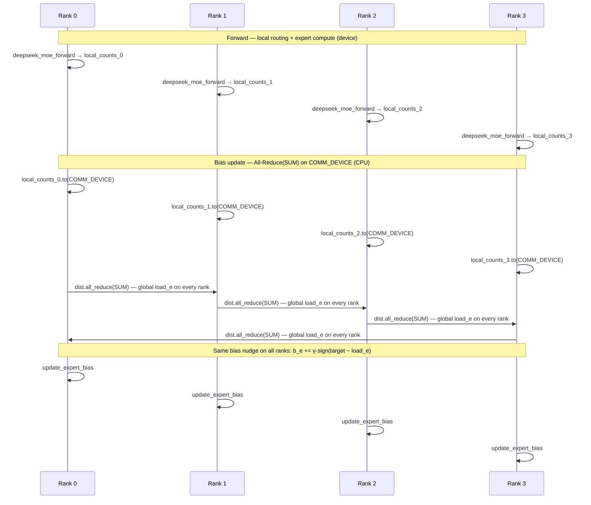

# DeepSeekMoE: Fine-Grained + Shared Experts with Auxiliary-Loss-Free Balancing

> Fine-grained routed experts plus always-on shared experts, with per-expert selection bias nudged from globally All-Reduced load — no auxiliary balancing loss.

## TL;DR

- **DeepSeekMoE architecture**: many small **fine-grained routed** experts plus a few **shared** experts that every token always hits.
- Output: $y = \sum_s \mathrm{shared}_s(x) + \sum_{e \in \mathrm{top\text{-}K}} g_e \cdot \mathrm{expert}_e(x)$.
- **Auxiliary-loss-free balancing**: a per-expert bias $b_e$ steers top-K **selection** only; gates come from raw affinity scores.
- After each step: $b_e \mathrel{+}= \gamma \cdot \mathrm{sign}(\mathrm{target} - \mathrm{load}_e)$ using **global** load from All-Reduce(SUM).
- This demo replicates router/experts on every rank; physical token dispatch lives in `1_naive_moe.py` / `2_lightning_moe.py`.

## The problem

Classic MoE layers scale capacity by routing each token to a handful of experts, but two tensions show up in production.

First, **specialization vs. duplication**: large monolithic experts can waste capacity re-learning common patterns every expert already knows. DeepSeekMoE splits capacity into many **fine-grained** routed experts (more combinatorial routing, sharper specialization) and adds **shared** experts that absorb universal knowledge so routed experts need not duplicate it.

Second, **load imbalance vs. training signal**: tokens cluster on a few "hot" experts unless you force balance. The usual fix is an **auxiliary balancing loss** added to the main objective — it works, but it fights the language-modeling loss and can distort gradients. DeepSeek-V3 replaces that loss with a **selection bias** updated from observed load: overloaded experts get nudged down, underloaded ones up, with no extra loss term.

In distributed training, "observed load" must be **global** across ranks. Each rank only sees its local token batch; without an All-Reduce of per-expert counts, every rank would nudge bias from a different view and balancing would diverge. That collective is the distributed twist in this demo.

## Algorithm

Constants in the skeleton: `N_ROUTED=8`, `N_SHARED=1`, `TOP_K=2`, `BIAS_SPEED=0.05` ($\gamma$).

1. **Router affinities** — For token batch $x \in \mathbb{R}^{T \times d}$ and router weights $W_r$:
   $$s_{t,e} = \mathrm{softmax}(x_t W_r)_e \quad \text{for } e \in \{0,\ldots,E-1\}, \; E = \texttt{N\_ROUTED}$$
2. **Biased top-K selection** — Add per-expert bias $b_e$ only for **which** experts are picked:
   $$\mathcal{K}_t = \mathrm{top\text{-}K}\bigl(\{ s_{t,e} + b_e \}_e\bigr)$$
   Gates must **not** use the biased scores:
   $$g_{t,e} = \frac{s_{t,e}}{\sum_{e' \in \mathcal{K}_t} s_{t,e'}} \quad \text{for } e \in \mathcal{K}_t, \quad \sum_{e \in \mathcal{K}_t} g_{t,e} = 1$$
3. **DeepSeekMoE forward** (provided as `deepseek_moe_forward`):
   $$y_t = \sum_{s=1}^{N_{\mathrm{shared}}} \mathrm{shared}_s(x_t) + \sum_{e \in \mathcal{K}_t} g_{t,e}\, \mathrm{expert}_e(x_t)$$
   Tally local per-expert token counts $\mathrm{local\_counts}_e$ while applying routed experts.
4. **Global load** — Move counts to **COMM_DEVICE**, then:
   $$\mathrm{load}_e = \sum_{r=0}^{\mathrm{world\_size}-1} \mathrm{local\_counts}_e^{(r)} \quad \text{via } \texttt{dist.all\_reduce(SUM)}$$
5. **Bias update** (auxiliary-loss-free):
   $$b_e \leftarrow b_e + \gamma \cdot \mathrm{sign}\!\left(\mathrm{target\_load} - \mathrm{load}_e\right)$$
   where $\mathrm{target\_load} = T \cdot \mathrm{world\_size} \cdot K / E$ for balanced routing.

Repeat steps 1–5 each training step. Bias steers selection; gates stay faithful to the router's raw affinities.

## Communication pattern

Each rank runs the full forward locally (replicated experts). Only the **bias update** crosses ranks — an All-Reduce to agree on global expert load before nudging $b_e$.



Golden rule: compute on the **`device`**; collectives run on tensors moved to **COMM_DEVICE**.

## What you'll see

`launch_teaching_cluster(world_size=4, func=run)` spawns four processes. Each rank holds its own local token slice (`TOKENS=32` per rank). Before your implementation, the run stops at:

```
NotImplementedError: TODO: deepseek_route -- biased top-K selection with raw-score gates
```

(or the analogous error from `update_expert_bias` once routing is done).

After both TODOs are correct, rank 0 prints per-step **local** expert token counts and the spread between max and min:

```
step 0 | rank0 local counts = [...] | local spread = ...
step 1 | rank0 local counts = [...] | local spread = ...
...
DeepSeekMoE done: bias-based balancing evens out expert load with no auxiliary loss.
```

There is **no max-error assertion** in this skeleton — the teaching outcome is qualitative. Early steps show skewed counts (hot experts dominate); as bias adapts from globally consistent load, per-step counts **even out** toward `target_load`. Watch the spread shrink across `STEPS=6`; that convergence is the observable proof that auxiliary-loss-free balancing works.

## Your battle zone

Two functions in `4_expert_parallel/3_deepseek_moe.py` raise `NotImplementedError` at `# TODO(you)` markers. `deepseek_moe_forward` is already wired; you supply routing and the distributed bias step.

**TODO 1 — `deepseek_route(scores, bias, top_k)`**

1. `idx = torch.topk(scores + bias, top_k, dim=-1).indices` — bias broadcast over the token dimension.
2. `gate = torch.gather(scores, 1, idx)` — gates from **raw** scores, not biased ones.
3. `gate = gate / gate.sum(dim=-1, keepdim=True)` — normalize to sum 1 per token.
4. Return `(idx, gate)`.

**TODO 2 — `update_expert_bias(bias, local_counts, world_size, target_load)`**

1. Move `local_counts` to **COMM_DEVICE**; `dist.all_reduce(..., op=dist.ReduceOp.SUM)` for global load.
2. `bias = bias + BIAS_SPEED * torch.sign(target_load - global_counts)`.
3. Return updated `bias`.

Imports already present: `torch.distributed as dist`, `COMM_DEVICE` from `env_setup`. Experts and router are replicated on every rank for clarity — no token All-to-All here.

## Run it

```bash
python 4_expert_parallel/3_deepseek_moe.py
```

## Papers & further reading

- Dai et al., 2024, "DeepSeekMoE: Towards Ultimate Expert Specialization in Mixture-of-Experts Language Models".
- Wang et al., 2024, "Auxiliary-Loss-Free Load Balancing Strategy for Mixture-of-Experts".
- DeepSeek-AI, 2024, "DeepSeek-V3 Technical Report".
