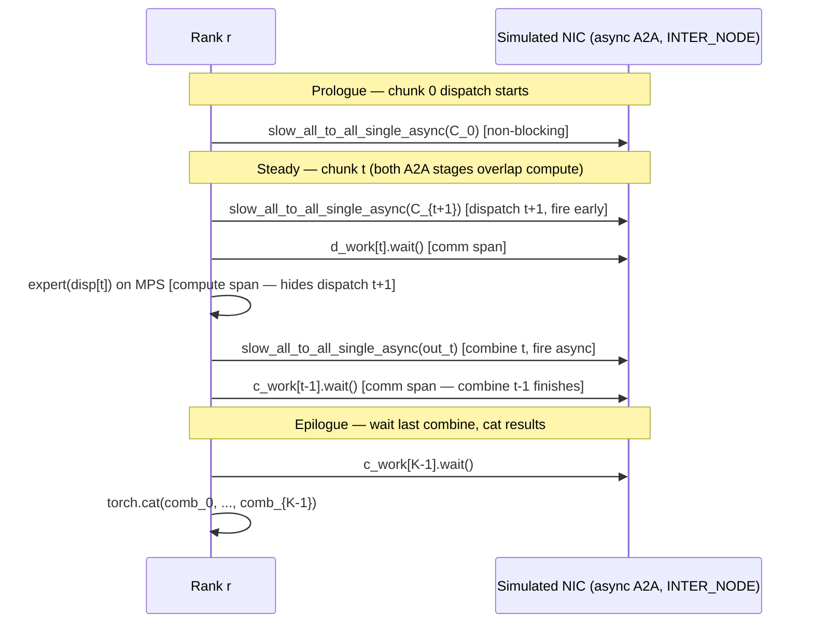

# DeepEP-Style Overlapped All-to-All: Dispatch + Combine

> Pipeline dispatch and combine All-to-All across token chunks so both communication stages hide behind expert compute, DeepEP-style.

## TL;DR

- **naive MoE** blocks on dispatch **and** combine — total time ≈ 2× comm + compute.
- **Lightning MoE** overlaps **dispatch only**; combine still waits out full latency.
- **DeepEP** pipelines the **entire** MoE layer: while chunk *t*'s expert runs, chunk *t+1*'s dispatch and chunk *t−1*'s combine are both in flight.
- Two network tiers modeled: **INTRA_NODE** (2 ms, NVLink-ish) vs **INTER_NODE** (20 ms, RDMA/IB); this demo uses **INTER_NODE** for cross-rank All-to-All and overlaps those slow transfers.
- Correctness: overlapped output must match **`reference_forward`** (same ops, reordered) — max error ≈ 0.

## The problem

Lightning MoE already hides dispatch latency behind expert compute, but the **combine** All-to-All still serializes after each tile's FFN. On real clusters, combine traffic often crosses slower inter-node links (RDMA/IB) while intra-node NVLink handles local fan-out. Waiting on combine while the GPU could be doing useful work leaves a second communication bubble on the critical path.

DeepSeek's **DeepEP** library attacks this by pipelining the **whole** MoE forward: token batches are chunked, and the schedule deliberately keeps **two** async All-to-Alls in flight during each expert step — the next chunk's dispatch and the previous chunk's combine. Communication is almost fully hidden behind compute when FFN work is large enough. This demo hand-writes that two-stage pipeline with `slow_all_to_all_single_async` so you can measure makespan against a fully serial estimate and verify bit-for-bit equivalence with the synchronous reference.

## Algorithm

Same MoE semantics as naive (dispatch → expert → combine), but the local token batch is split with **`split_chunks(tokens, NUM_CHUNKS)`** along the token dimension. `NUM_CHUNKS` must divide the token count so equal-split All-to-All stays valid per chunk.

Let chunks be $C_0, \ldots, C_{K-1}$ with $K$ = `NUM_CHUNKS`.

1. **Prologue** — Fire async dispatch for chunk 0:
   - `disp0 = empty_like(C_0)` on **COMM_DEVICE**
   - `d_work0 = slow_all_to_all_single_async(disp0, C_0, INTER_NODE)`
2. **Steady state** — For each chunk index $t \in [0, K)$:
   - If $t + 1 < K$, fire async dispatch for chunk $t+1$ (inter-node, slow — overlaps with upcoming compute).
   - `d_work[t].wait()` inside a comm timeline span — tops up only remaining simulated latency.
   - `out_t = expert(disp[t].to(device))` inside a compute span on **MPS**.
   - Fire async combine for `out_t`:
     - `comb_t = empty_like(out_t)` on **COMM_DEVICE**
     - `c_work[t] = slow_all_to_all_single_async(comb_t, out_t, INTER_NODE)`
   - If $t - 1 \geq 0$, `c_work[t-1].wait()` and stash `comb[t-1]` as a finished result.
   At any moment during steady state, dispatch($t+1$) and combine($t-1$) are both in flight while expert($t$) computes.
3. **Epilogue** — Wait the last combine (`c_work[K-1].wait()`), collect all `comb[t]`, `torch.cat` along dim 0, return.

Contrast with lightning: lightning overlaps dispatch only; DeepEP overlaps **both** All-to-All stages across chunks. Output equals the synchronous reference — it is the same operations, just reordered and async.

## Communication pattern



Each rank runs this pipeline independently. All-to-All is a collective, but the **overlap schedule** is per-rank software pipelining. Comm tensors live on **COMM_DEVICE** (CPU); gloo requires CPU tensors for collectives.

## What you'll see

`launch_teaching_cluster(world_size=4, func=run)` spawns four processes. Each rank prints local token shape, inter-node vs intra-node latency, and `NUM_CHUNKS = 4`. Before your implementation:

```
NotImplementedError: TODO: deepep_moe_forward -- overlap BOTH dispatch and combine across chunks
```

After a correct pipeline, rank 0 prints:

```
DeepEP makespan = XXX.X ms | max error vs synchronous = 0.00e+00
```

The **max error vs synchronous** compares your overlapped result against **`reference_forward`** (blocking dispatch → expert → combine on `INTER_NODE`). Correct overlap reorders work but must not change numerics — expect error ≈ 0.

Then an ASCII comparison bar via **`bar(value, total)`**:

```
  -- inter-node All-to-All hidden behind compute --
  serial(est) |####################----------------|  160.0 ms
  deepep      |##########--------------------------|   80.0 ms
```

`serial(est)` is `2 * NUM_CHUNKS * INTER_NODE.latency_s` — a rough ceiling if every inter-node hop paid full latency with no overlap. **Timeline** spans should show comm waits interleaved with compute when both All-to-All stages are hidden.

## Your battle zone

Implement **`deepep_moe_forward(rank, world_size, expert, tokens, device, timeline)`** in `4_expert_parallel/deepseek_deepep.py`. The `# TODO(you)` currently raises `NotImplementedError`.

Provided helpers — use them, do not reimplement:

- **`split_chunks(tokens, NUM_CHUNKS)`** — split the batch along the token dim.
- **`slow_all_to_all_single_async(output, input, link)`** — returns a handle with `.wait()` that tops up only remaining modeled latency (enables overlap).
- **`reference_forward(expert, tokens, device)`** — synchronous baseline for the correctness check.

Pattern:

```python
chunks = split_chunks(tokens, NUM_CHUNKS)
# Keep lists/dicts for in-flight work handles and buffers (disp, comb, d_work, c_work).
# Prologue: disp0 on COMM_DEVICE, d_work0 = slow_all_to_all_single_async(disp0, chunks[0], INTER_NODE)
# Steady loop over t:
#   - fire async dispatch for chunks[t+1] if it exists
#   - timeline.span(..., kind="comm"): d_work[t].wait()
#   - timeline.span(..., kind="compute"): out_t = expert(disp[t].to(device))
#   - fire async combine: c_work[t] = slow_all_to_all_single_async(comb_t, out_t, INTER_NODE)
#   - if t-1 >= 0: timeline.span(..., kind="comm"): c_work[t-1].wait(); stash comb[t-1]
# Epilogue: wait last combine, torch.cat all comb chunks, return .to(device)
```

Key imports: `LinkProfile`, `slow_all_to_all_single_async` from `topology_sim`; **`COMM_DEVICE`**, **`Timeline`**, **`bar`** from `env_setup`. Compute on **MPS** (`device`); all All-to-All buffers on **COMM_DEVICE**.

Constants: `WORLD_SIZE=4`, `TOKENS_PER_EXPERT=32`, `NUM_CHUNKS=4`, `DIM=64`, `INTRA_NODE` (2 ms), `INTER_NODE` (20 ms).

## Run it

```bash
python 4_expert_parallel/deepseek_deepep.py
```

## Papers & further reading

- DeepSeek-AI, 2025, "DeepEP: an efficient expert-parallel communication library" (open-source).
- DeepSeek-AI, 2024, "DeepSeek-V3 Technical Report" (computation-communication overlap).
- Hwang et al., 2022, "Tutel: Adaptive Mixture-of-Experts at Scale".
