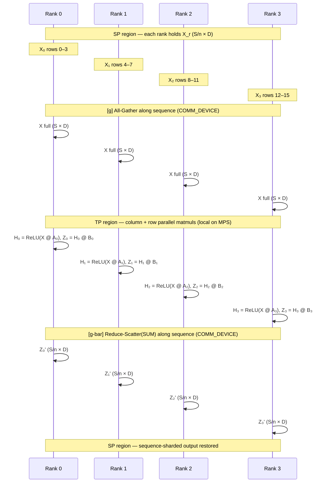

# Megatron Sequence Parallel: All-Gather / Reduce-Scatter Conjugate Pair

> Shard activations along the sequence dimension outside tensor-parallel matmuls, then transition into and out of the TP region with a conjugate pair of collectives that preserves communication volume.

## TL;DR

- Pure Tensor Parallel (Module 2) replicates activations in LayerNorm, Dropout, and residual regions — every TP rank holds the full `[S, D]` tensor.
- **Sequence Parallel (SP)** shards those regions along the sequence axis: rank $r$ holds $X_r \in \mathbb{R}^{S/n \times D}$.
- Entering the TP matmul region uses **g** (All-Gather along sequence); exiting uses **g-bar** (Reduce-Scatter with SUM along sequence).
- Total communication volume matches pure TP's single All-Reduce, but activation memory in the non-matmul regions drops by factor $n$.

## The problem

Megatron-style tensor parallelism splits weight matrices across ranks so each device holds only a fraction of each linear layer. That works well inside the matmuls, but the regions *between* them — LayerNorm, Dropout, residual adds — still need the full activation tensor on every rank. For long sequences, those replicated activations dominate memory. Sequence Parallelism (Megatron-LM SP) extends sharding to the sequence dimension in those regions: each rank stores only its local chunk `[S/n, D]`. The challenge is transitioning cleanly between sequence-sharded and tensor-parallel compute without changing total communication cost or breaking correctness of the row-parallel partial sums.

## Algorithm

Let `world_size` $= n$, sequence length $S$, hidden dim $D$, FFN width $F$, shard size $L = S/n$. Weights: $A \in \mathbb{R}^{D \times F}$ (column-sharded), $B \in \mathbb{R}^{F \times D}$ (row-sharded). The demo runs the canonical Megatron block with `SEQ=16`, `DIM=8`, `FFN=32`, `WORLD_SIZE=4`.

1. **SP region (setup, provided)**: Rank $r$ holds sequence shard $X_r = X[rL : (r+1)L, :] \in \mathbb{R}^{L \times D}$.
2. **g — enter TP region (`enter_tp_region`)**: **All-Gather** along dim 0 concatenates shards in rank order:
   $$X = \text{AllGather}(X_0, \ldots, X_{n-1}) \in \mathbb{R}^{S \times D}.$$
   Backward of g is Reduce-Scatter (conjugate).
3. **Column-parallel Linear + ReLU (provided, Module 2)**: Each rank holds $A_r \in \mathbb{R}^{D \times F/n}$ and computes
   $$H_r = \text{ReLU}(X A_r) \in \mathbb{R}^{S \times F/n}.$$
4. **Row-parallel Linear (provided, Module 2)**: Each rank holds $B_r \in \mathbb{R}^{F/n \times D}$ and computes a **partial sum**
   $$Z_r = H_r B_r \in \mathbb{R}^{S \times D}.$$
   Summing across ranks would yield the full output; no All-Reduce is needed yet.
5. **g-bar — exit TP region (`exit_tp_region`)**: **Reduce-Scatter(SUM)** along dim 0 sums the partials and scatters sequence chunks:
   $$Z_r' = \text{ReduceScatterSUM}(Z_0, \ldots, Z_{n-1})[r] \in \mathbb{R}^{L \times D}.$$
   The SUM is correct because row-parallel partials add across the FFN shard dimension; scattering along sequence restores the SP layout. Backward of g-bar is All-Gather (conjugate).

Net effect: activation memory in LN/Dropout/residual regions scales as $1/n$; total bytes moved per block equals pure TP's All-Reduce.

## Communication pattern



## What you'll see

On launch, `launch_teaching_cluster` prints a banner with `world_size=4` and `backend=gloo`, then spawns four color-coded rank logs. Each rank reports its sequence shard, e.g. `sequence shard x_local = (4, 8) (full seq = 16)`. Before your implementation, the run stops at:

```
NotImplementedError: TODO: enter_tp_region (g) -- hand-write All-Gather along the sequence dim
```

After both TODOs are correct, rank 0 prints something like:

```
SP output (gathered) shape = (16, 8) | max error vs single-machine = 1.19e-06
```

The demo builds identical full tensors via `build_full_inputs_and_weights`, computes a single-machine reference $\text{ReLU}(X A) B$ on CPU, gathers your sequence-sharded outputs, and reports max absolute error. A correct implementation should land near **~1e-6**.

## Your battle zone

Two functions in `5_sequence_parallel/1_megatron_sp.py` raise `NotImplementedError`:

1. **`enter_tp_region(x_local, world_size, device)`** — g operator:
   - Allocate `x_full` of shape `[SEQ, DIM]` on **`COMM_DEVICE`** (`cpu`).
   - `dist.all_gather_into_tensor(x_full, x_local.to(COMM_DEVICE).contiguous())` — concatenates shards along dim 0 in rank order.
   - Return `x_full.to(device)`.

2. **`exit_tp_region(z_partial, world_size, device)`** — g-bar operator:
   - Allocate `z_local` of shape `[SHARD, DIM]` on **`COMM_DEVICE`**.
   - `dist.reduce_scatter_tensor(z_local, z_partial.to(COMM_DEVICE).contiguous(), op=dist.ReduceOp.SUM)`.
   - Return `z_local.to(device)`.

Golden rule: compute on MPS, move to **`COMM_DEVICE`** before gloo collectives, move back after. Column- and row-parallel matmuls between the two TODOs are already wired from Module 2.

## Run it

```bash
python 5_sequence_parallel/1_megatron_sp.py
```

## Papers & further reading

- Korthikanti et al., 2022, "Reducing Activation Recomputation in Large Transformer Models" (Megatron-LM Sequence Parallelism).
- Shoeybi et al., 2019, "Megatron-LM: Training Multi-Billion Parameter Language Models Using Model Parallelism".
