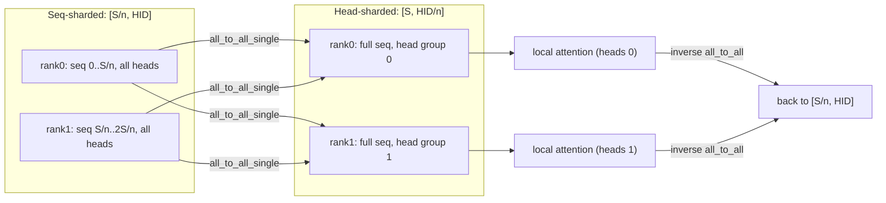

# DeepSpeed-Ulysses Sequence Parallel: All-to-All head/sequence swap

> Keep activations sequence-sharded everywhere, and around attention use two All-to-All calls to swap the partition between "sharded by sequence" and "sharded by head", so each rank runs ordinary full-sequence attention for its own heads.

## TL;DR

- **Megatron SP** (the baseline in this module) gathers the full activation along the sequence to enter the tensor-parallel region. **DeepSpeed-Ulysses** instead swaps the *partition dimension* with All-to-All right around attention.
- Activations stay sharded along the sequence ($S/n$ per rank) for the whole model. For attention, one All-to-All turns `[S/n, HID]` (seq-sharded, all heads) into `[S, HID/n]` (full sequence, this rank's heads); a second All-to-All swaps back.
- Each rank then runs a **plain** full-sequence attention over its own head group -- no ring, no online softmax.
- Communication is two All-to-All ops; their per-message volume is independent of sequence length, which is why Ulysses scales context length cheaply for many-head models.

## The problem

Attention needs every query to attend to every key. If you naively shard the sequence across ranks, each rank only has $1/n$ of the keys/values, so it cannot finish attention locally. Megatron SP solves the surrounding LayerNorm/Dropout memory, and Ring Attention (Module 6) solves attention by circulating K/V. Ulysses takes a third route: rather than move K/V repeatedly, it **re-partitions** the tensor once before attention (sequence to head) and once after (head to sequence). After the first swap, each rank holds the *entire* sequence but only $H/n$ heads, so a standard local attention is exact. The trick is that attention is "embarrassingly parallel across heads", so a head-wise partition makes the op fully local.

## Algorithm

Let `world_size` $= n$, sequence $S$, heads $H$, head dim $D$, hidden $\text{HID} = H \cdot D$. This demo sets $H = n$ so each rank ends up with exactly one head; in general each rank gets $H/n$ heads. Local sequence shard $\text{SH} = S/n$, local hidden shard $\text{HID/n}$. Rank $r$ starts with $Q_r, K_r, V_r \in \mathbb{R}^{\text{SH} \times \text{HID}}$.

1. **Seq -> Head All-to-All** (`all2all_seq_to_head`, your TODO): reshape so rows are grouped by destination rank, then `dist.all_to_all_single`, yielding $\mathbb{R}^{S \times \text{HID}/n}$ -- the full sequence but only this rank's head group.
   - Group by destination: `inp = x.reshape(SH, n, HID/n).transpose(0,1).reshape(n*SH, HID/n)`.
   - `all_to_all_single(out, inp)`; chunk $k$ of `out` is rank $k$'s sequence shard for our heads, so `out.reshape(S, HID/n)` is the full sequence in order.
2. **Local attention** (`local_attention`, provided): for the local head group,
   $$O = \text{softmax}\!\left(\frac{Q K^\top}{\sqrt{D}}\right) V \in \mathbb{R}^{S \times \text{HID}/n}.$$
3. **Head -> Seq All-to-All** (`all2all_head_to_seq`, your TODO): the inverse swap, turning $\mathbb{R}^{S \times \text{HID}/n}$ back into $\mathbb{R}^{\text{SH} \times \text{HID}}$ (sequence-sharded, all heads).
   - `inp = o.reshape(n, SH, HID/n).reshape(n*SH, HID/n)`; `all_to_all_single`; then `out.reshape(n, SH, HID/n).transpose(0,1).reshape(SH, HID)`.

Total exchanged data per All-to-All is $S \cdot \text{HID}/n$ elements per rank, independent of how the heads are grouped.

## Communication pattern



## What you'll see

On launch, `launch_teaching_cluster` prints a banner (`world_size=4`, `backend=gloo`) and four color-coded rank logs, each reporting `seq-sharded Q/K/V = (4, 32) (full seq = 16, heads = 4)`. Before you implement the TODOs the run stops at:

```
NotImplementedError: TODO: all2all_seq_to_head -- hand-write the seq->head All-to-All swap
```

After a correct implementation, rank 0 prints something like:

```
Ulysses-SP output shape = (16, 32) | max error vs single-machine = 0.00e+00
```

The demo builds full Q, K, V, computes a single-machine multi-head attention reference, gathers the sequence-sharded outputs with All-Gather, and reports the max absolute error -- which should be ~0 (All-to-All is just a permutation of exact values).

## Your battle zone

Implement two functions in `5_sequence_parallel/2_ulysses_sp.py`:

1. **`all2all_seq_to_head(x_local, world_size, device)`** -- the reshape "group by destination" is given; you write `dist.all_to_all_single` on `COMM_DEVICE` tensors, then view as `[SEQ, HID/n]`.
2. **`all2all_head_to_seq(o_head, world_size, device)`** -- the inverse swap, same pattern.

Remember the golden rule: compute on `device`, but the All-to-All runs on **`COMM_DEVICE`** (the comm device). `local_attention` is provided.

## Run it

```bash
python 5_sequence_parallel/2_ulysses_sp.py
```

## Papers & further reading

- Jacobs et al., 2023, "DeepSpeed Ulysses: System Optimizations for Enabling Training of Extreme Long Sequence Transformer Models".
- Korthikanti et al., 2022, "Reducing Activation Recomputation in Large Transformer Models" (Megatron-LM Sequence Parallelism).
