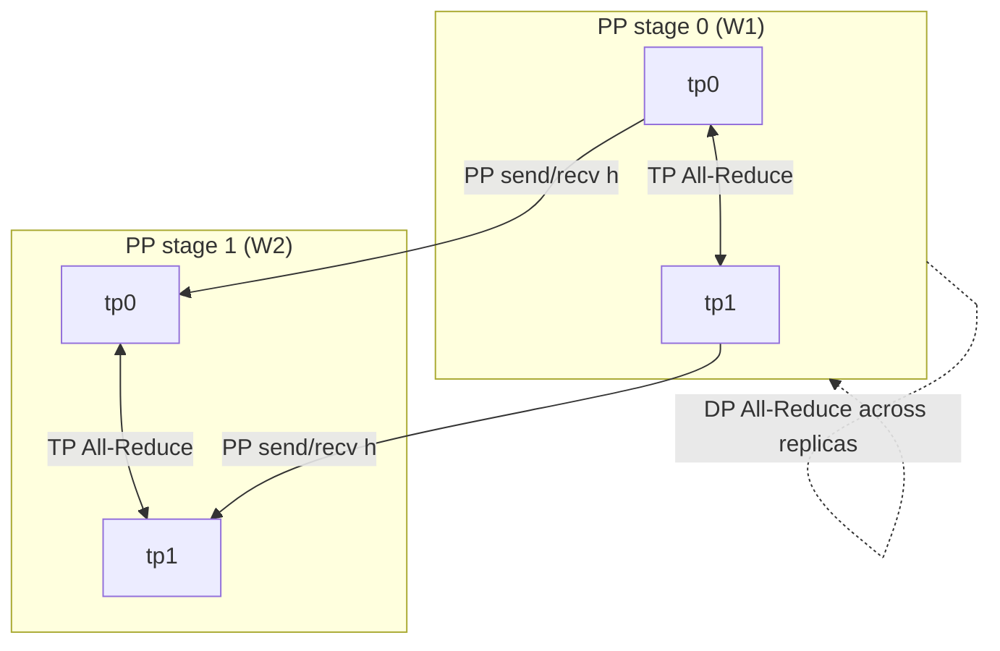

# 3D Parallelism (Data × Tensor × Pipeline)

> The capstone: lay ranks on a 3D mesh and give each axis its own process groups — TP All-Reduce within a layer, PP send/recv across stages, DP All-Reduce across replicas. This is how GPT-scale training actually runs.

## TL;DR

- Each parallelism axis attacks a different cost: **TP** splits a layer's matmul, **PP** splits the model by depth, **DP** replicates over data.
- 3D parallelism composes all three: `world_size = PP × DP × TP`, with `rank = pp·(DP·TP) + dp·TP + tp`.
- A rank belongs to **three** process groups at once and uses the right collective for each axis.
- This demo wires a 2-stage pipeline (PP=2), each stage a row-parallel linear over TP=2, replicated over DP=2 — the smallest mesh exercising all three.

## The problem

No single axis scales forever: TP is limited by intra-node bandwidth, PP by the bubble and depth, DP by memory (it replicates the whole model). Frontier training (Megatron-DeepSpeed, GPT-3/4-scale) composes them so each handles the regime it's good at. The hard part is bookkeeping: mapping a flat rank id to a 3D coordinate, building one set of groups per axis, and issuing each collective in the correct group.

## Algorithm

Coordinates: `pp_idx = rank // (DP·TP)`, `dp_idx = (rank % (DP·TP)) // TP`, `tp_idx = rank % TP`.

Three group families (each built collectively via `dist.new_group`):
- **TP group** — fix `(pp, dp)`, vary `tp`: All-Reduce partial matmuls inside a layer.
- **PP group** — fix `(dp, tp)`, vary `pp`: send/recv activations between stages.
- **DP group** — fix `(pp, tp)`, vary `dp`: All-Reduce gradients across replicas.

Forward through the toy net $y = \text{relu}(xW_1)W_2$:
1. **Stage 0** (`pp=0`): row-parallel $W_1$ — each TP rank computes a partial $x_{\text{col}}W_1^{\text{shard}}$, **TP All-Reduce(SUM)**, apply ReLU → full hidden $h$; **PP send** $h$ to its stage-1 partner.
2. **Stage 1** (`pp=1`): **PP recv** $h$, row-parallel $W_2$ — partial $h_{\text{col}}W_2^{\text{shard}}$, **TP All-Reduce(SUM)** → output $y$.
3. **DP axis**: a per-replica probe tensor is **All-Reduced within the DP group only** (divide by `DP`, not `world_size`) to show replica averaging.

## Communication pattern



## What you'll see

Eight ranks each print their mesh coordinate, e.g. `mesh coord pp=1 dp=0 tp=1`. Before implementation:

```
NotImplementedError: TODO: hybrid_forward -- TP All-Reduce within a stage + PP send/recv across stages
```

When both TODOs are correct, stage-1 ranks print `max error vs single-machine` ~`1e-6` (the full network output matches the reference), stage-0 ranks check the hidden activation, and every rank prints `dp_average(probe)` equal to the mean of the DP indices.

## Your battle zone

Two functions in `8_hybrid_parallel/three_d_parallel.py`:

1. **`hybrid_forward(...)`** — per stage: partial matmul → `dist.all_reduce(..., group=tp_group)`; stage 0 `dist.send` to `rank + DP·TP`, stage 1 `dist.recv` from `rank - DP·TP` (both via `pp_group`).
2. **`dp_average(t, dp_group)`** — `dist.all_reduce(..., group=dp_group)` then divide by `DP`.

The 3D mesh of groups is pre-built in `build_3d_mesh`.

## Run it

```bash
python 8_hybrid_parallel/three_d_parallel.py   # world_size must equal PP*DP*TP
```

## Papers & further reading

- Narayanan et al., 2021, "Efficient Large-Scale Language Model Training on GPU Clusters Using Megatron-LM" (SC21) — 3D parallelism.
- Smith et al., 2022, "Using DeepSpeed and Megatron to Train Megatron-Turing NLG 530B".
- Shoeybi et al., 2019, "Megatron-LM: Training Multi-Billion Parameter Language Models Using Model Parallelism".
