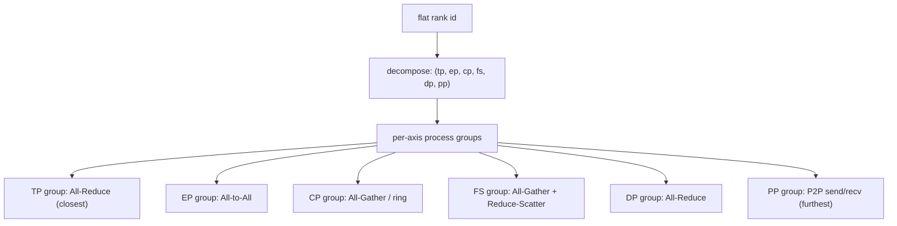

# N-D ("6D") Mesh Parallelism

> Every parallelism in this repo is one axis of a single device mesh. This capstone composes them all in the canonical hierarchy `[TP, EP, CP, FS, DP, PP]`, prints each rank's coordinate, and "flashes" which process group communicates for each axis.

## TL;DR

- A rank's flat id decomposes into a **coordinate along every parallelism axis**; each axis owns a set of **process groups** (the "lines" of the mesh).
- Canonical hierarchy, innermost (closest, fastest links) → outermost (furthest): **`TP → EP → CP → FS → DP → PP`**.
- During a step, each axis's group "flashes" when its collective fires — the others are already hand-written in modules 1-7; here we **compose and visualize** them.
- Inspired by the post *"Visualizing 6D Mesh Parallelism"*.

## The 0D → 6D ladder

The blog builds intuition by adding one axis at a time. Each maps to a module you've already built:

| Dim | Axis | Collective | Hand-written in |
| --- | --- | --- | --- |
| 0D | — | none (single perfect GPU) | — |
| 1D | **DP** | grad All-Reduce | `1_data_parallel/1_ddp_demo.py` |
| 2D | **FS** (+DP) | All-Gather params + Reduce-Scatter grads (+ DP All-Reduce) | `1_data_parallel/3_fsdp_demo.py`, `4_hsdp_demo.py` |
| 3D | **TP** | per-layer All-Reduce | `2_tensor_parallel/*` |
| 4D | **CP** | K/V All-Gather (or ring P2P) | `6_context_parallel/1_ring_attention.py` |
| 5D | **EP** | dispatch + combine All-to-All | `4_expert_parallel/*` |
| 6D | **PP** | activation P2P send/recv | `3_pipeline_parallel/*` |

So 6D parallelism is *literally* this repo's modules 1-7, stacked onto one mesh.

## Why this hierarchy order?

TP sits **closest** (innermost): it All-Reduces every layer, so it must ride the lowest-latency links (intra-node NVLink). PP sits **furthest** (outermost): it only exchanges activations at stage boundaries a few times per step, so it tolerates slow cross-island links. CP and FS are placed adjacent because CP is often "folded" into the FS group for weight synchronization. The mesh decomposition makes the innermost axis vary fastest, so a TP group is a block of **contiguous** ranks:

$$\text{rank} = \sum_{a}\, \text{coord}[a]\cdot \text{stride}[a], \qquad \text{stride grows from TP outward.}$$

A process group for axis $a$ is the set of ranks sharing every *other* coordinate and differing only along $a$.

## Communication pattern



## What you'll see

The default mesh `{TP:2, EP:1, CP:2, FS:1, DP:2, PP:1}` spawns 8 ranks and lights up **TP, CP, DP** (the others are degenerate, size 1). Rank 0 prints the mesh summary and the axis→collective map; every rank prints its 6D coordinate, e.g. `coord TP=1 EP=0 CP=0 FS=0 DP=1 PP=0`.

Before implementation it stops at:

```
NotImplementedError: TODO: ping_axis -- All-Reduce a coordinate probe over the axis's process group
```

Once implemented, each active axis prints a colored **flash** strip (ranks colored by their group along that axis) and a verification, e.g. `TP ping=1.0 (expected 1.0) OK`. Bump the `MESH` sizes (and the world grows) to light up EP / FS / PP too.

## Your battle zone

One function in `8_hybrid_parallel/2_nd_mesh_parallel.py` — `ping_axis(mesh, axis)`:

```python
group = mesh.groups[axis]
probe = torch.full((1,), float(mesh.coords[axis]), device=COMM_DEVICE)
dist.all_reduce(probe, op=dist.ReduceOp.SUM, group=group)
return probe.item()
```

Because each group along an axis holds exactly one rank per coordinate, the sum must equal $0+1+\dots+(n-1) = n(n-1)/2$. The whole mesh (coordinates + per-axis groups) is built for you by `build_mesh` in `env_setup` — the reusable N-D mesh helper this demo is meant to showcase.

## Run it

```bash
python 8_hybrid_parallel/2_nd_mesh_parallel.py
# light up more axes (16 ranks): edit MESH, e.g. {"TP":2,"EP":2,"CP":1,"FS":2,"DP":2,"PP":1}
```

## Papers & further reading

- "Visualizing 6D Mesh Parallelism", main-horse, 2024 — https://main-horse.github.io/posts/visualizing-6d/
- Narayanan et al., 2021, "Efficient Large-Scale Language Model Training on GPU Clusters Using Megatron-LM" (SC21).
- Dubey et al., 2024, "The Llama 3 Herd of Models" — 4D parallelism mesh ordering discussion.
- PyTorch `DeviceMesh` / `torch.distributed.device_mesh` documentation.
